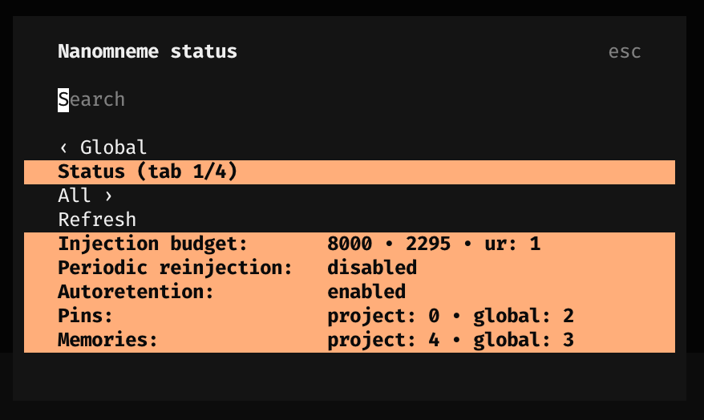
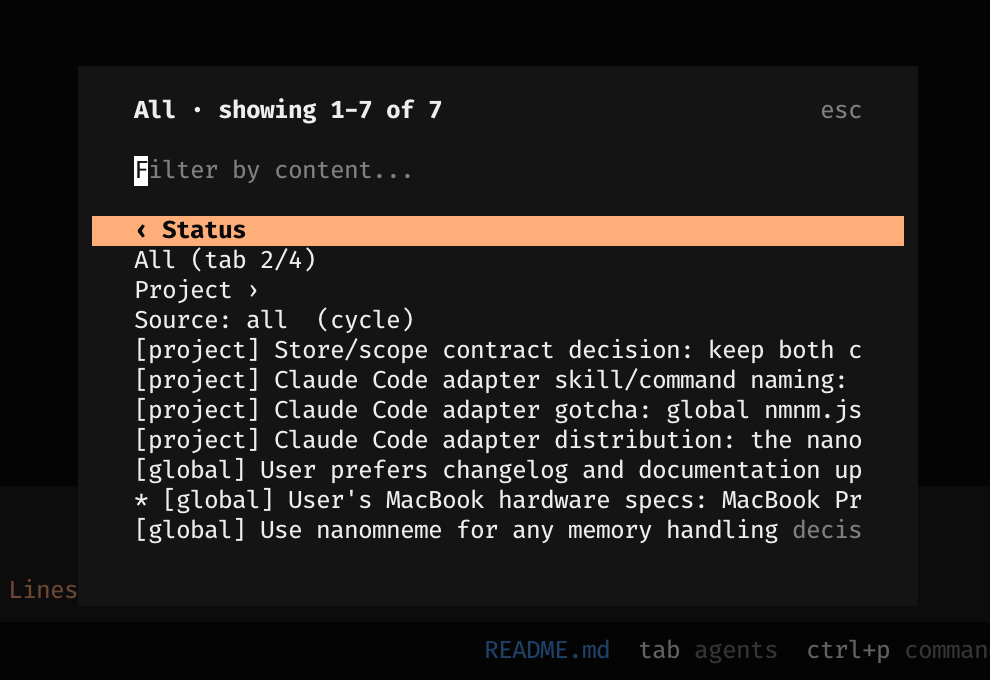
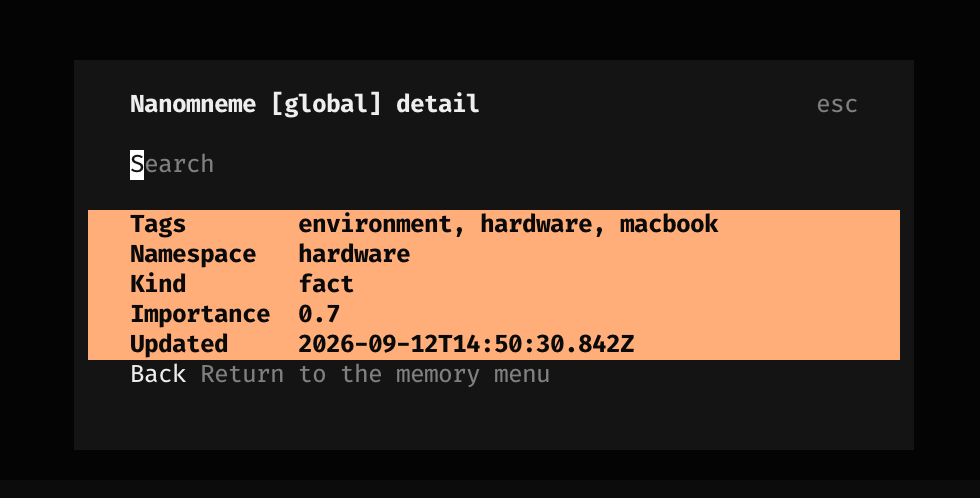

# @openlines/nmnm-opencode

<div align="center">

[](https://www.npmjs.com/package/@openlines/nmnm-opencode) [](https://www.npmjs.com/package/@openlines/nmnm-opencode)

</div>

OpenCode adapter for [nanomneme](https://github.com/linellazatin/nanomneme): a server plugin that gives OpenCode native, observable memory tools backed by the shared nanomneme SQLite store, bounded transient memory-index injection during the session, and a model-free TUI memory browser. Memory is reusable across OpenCode, Pi, Claude Code, and other adapters; only the harness-facing surface differs.

## What it provides

- A native OpenCode **server plugin** (`index.js`) registering `retain_memory`, `recall_memory`, `retrieve_memory`, and `remove_memory` via the `@opencode-ai/plugin` tool API. OpenCode loads plugins under Bun, which has no `node:sqlite`, so each core call runs in a short-lived spawned `node` bridge (`src/bridge.js`) rather than in the Bun host. No MCP server, daemon, or network. New retains record `metadata.source` as `"opencode"`; ID-based patches preserve an existing source. Only `retain_memory` creates a missing store; reads and soft removal never create one. Removal is always soft; purge stays `nmnm`-CLI-only.
- **Bounded transient injection** through `experimental.chat.system.transform`: the project and global pin set and recent active memories (and optional autoretention guidance) are appended to the system prompt on every model request whose context is non-empty. OpenCode rebuilds the system prompt per request, so no cadence/compaction/mutation gating is needed and the `reinjection` setting stays inert. No context is ever written to disk.
- A deterministic, model-free **management CLI** — `nmnm-opencode` (`status`, `list`, `search`, `show`, `pin`, `unpin`, `remove`).
- An optional model-free **TUI memory browser** (`tui.js`, registered via `tui.jsonc`) opened on **ctrl+alt+m**: a compact label-aligned Status summary plus All / Project / Global tabs, source cycling, pin/unpin, and confirmed soft removal, all routed through the same Node bridge.







## Install

Requires Node.js 22.13+ with FTS5 in `node:sqlite` on `PATH` (or set `NMNM_NODE`) for the bridge, and an OpenCode version exposing the `@opencode-ai/plugin` server API. Add the npm plugin to your OpenCode config:

```jsonc
// opencode.json
{
  "$schema": "https://opencode.ai/config.json",
  "plugin": ["@openlines/nmnm-opencode"]
}
```

OpenCode installs npm plugins (and their dependencies) via Bun at startup and caches them.

### Enable the TUI browser

The TUI browser is a separate plugin entry from the server plugin. Register the same package in `~/.config/opencode/tui.jsonc`; OpenCode resolves the package's `./tui` export:

```jsonc
{ "plugin": ["@openlines/nmnm-opencode"] }
```

Restart OpenCode, then press **ctrl+alt+m** to open the model-free browser. It provides Status, All, Project, and Global tabs plus source filtering, pin/unpin, and confirmed soft removal.

For local development from this checkout, point the entry at the source instead:

```jsonc
{ "plugin": ["file:///absolute/path/to/nanomneme/adapters/opencode/index.js"] }
```

Register the TUI source separately in `~/.config/opencode/tui.jsonc`:

```jsonc
{ "plugin": ["file:///absolute/path/to/nanomneme/adapters/opencode/tui.js"] }
```

The four memory tools then appear natively to the agent. See the [OpenCode Adapter Manual](docs/OPENCODE_ADAPTER_MANUAL.md) for the full guide, including the compatibility probes and the manual smoke check.

## Configuration

- Project settings (shared across adapters): `<repo>/.nanomneme/nmnm.jsonc`.
- Global settings: `${XDG_CONFIG_HOME:-~/.config}/opencode/nmnm.jsonc`.
- Pins (adapter-owned): `<repo>/.nanomneme/nmnm-opencode.json` and `~/.local/share/nanomneme/nmnm-opencode.json`.

See the [OpenCode Adapter Manual](docs/OPENCODE_ADAPTER_MANUAL.md) for the config schema, tool reference, and injection lifecycle.

## Develop

```sh
node --test adapters/opencode/test/*.test.js
```

## Shared opt-in diagnostics

Set `"logging": { "enabled": true }` in `~/.local/share/nanomneme/config.jsonc` to enable the shared default. JSONC comments and trailing commas are supported. Adapter user-level `nmnm.jsonc` can explicitly enable or disable logging; absence inherits. Either invalid applicable logging configuration disables that caller. Project settings cannot authorize logging. Records use the shared `logslines/v1` catalog and core-distributed runtime, omit structured memory payloads and stack traces, preserve thrown-error messages verbatim without redaction, and append to `~/.local/share/nanomneme/logs/<component>.jsonl`. Error messages may expose sensitive input or paths; review logs before sharing. Logging failures preserve operations and output. Existing databases, pin files, and logs require no migration.

OpenCode uses its existing user settings resolver under the OpenCode config directory. Node tool operations, CLI mutations, and confirmed TUI mutations are observed; index/navigation reads are unlogged. Each bridge process resolves settings anew. Spawn failures emit one host-side failed record because the bridge never ran; ambiguous post-spawn transport/parse failures remain unlogged to avoid contradicting a bridge outcome. Correlation is null unless trusted host context supplies a verified ID.
