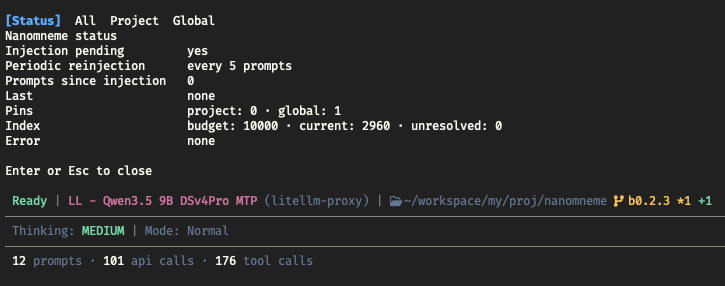
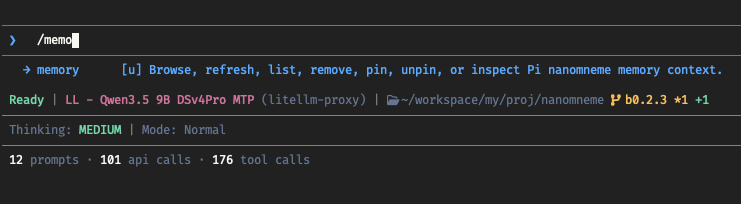
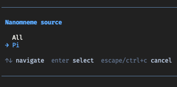
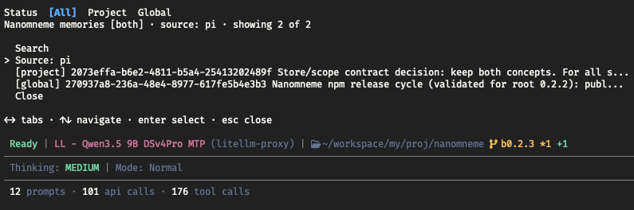
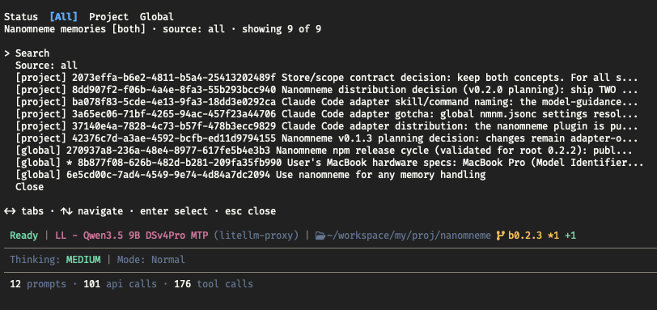

# @openlines/nmnm-pi

Pi package for the [nanomneme](https://github.com/linellazatin/nanomneme) SQLite memory adapter. It imports `@openlines/nmnm-core`
directly and never shells out to the CLI.

## Features

- **Native memory tools:** model-invoked retain, recall, retrieve, and remove operations over `nmnm-core`; the browser and `/memory list` can show all or Pi-source records.
- **Project and global memory:** explicit store selection with canonical records and no custom database-path parsing.
- **Bounded automatic context:** transient autoretention guidance and the first-prompt memory index share one configurable character budget; pinned entries come first, with recent active fallback, store and recorded-source labels, unresolved-pin reporting, and refresh after successful compaction or memory mutations.
- **Opt-in autoretention:** project/global JSONC rules guide the active model's `retain_memory` calls without a nested model, worker, or direct adapter write.
- **Adapter-owned configuration:** optional JSONC settings and separate JSON pin files, with project and global locations.
- **Direct user controls:** `/memory refresh`, `status`, `list`, `remove`, `pin`, and `unpin` without model involvement; `status` reports injection state, autoretention, the effective index budget, current full-payload character count, and lifecycle metadata without exposing memory content.

  
- **Native memory browser:** `/memory` and `/memory browse` show the shared status card before opening; record details stay inside a native action dialog, so the card remains visible on return. Search and store controls stay above each record page.

  

  

  
- **Readable list UX:** project-first combined listing, pagination, `[project]` and `[global]` labels, exact-store `*` pin markers, and 60-character previews; browser rows omit IDs, which remain in details.

  
- **Safety boundaries:** validated pin targets, ambiguity-safe removal, soft-only slash removal, non-creating native reads, and durable unresolved pins.


## Quickstart
Install it globally with Pi:

```sh
pi install npm:@openlines/nmnm-pi
```

From a repository checkout, load it for one run:

```sh
pi -e ./adapters/pi/extensions/index.js
```

To add this checkout as a project-local Pi package:

```sh
pi install -l "$(pwd)/adapters/pi"
```

New `retain_memory` entries record `metadata.source` as `"pi"`; ID-based patches preserve an
existing source. Retain scope selects the matching write store: omit it for project or use
`scope: "global"` for global. The browser and `/memory list` can show all records or Pi-source
records. The model-facing `remove_memory` tool and `/memory remove` are soft-only; irreversible
purge remains an explicit CLI operation. Run `/memory` or `/memory browse` for the model-free
custom browser: left/right changes Status, All, Project, and Global tabs. Record details remain in
a native action dialog; search and source controls remain in each store tab. `/memory status`
remains available for an on-demand card. Explicit list, refresh, pin, unpin, and soft-remove
subcommands remain available.

See the [Pi Adapter Manual](docs/PI_ADAPTER_MANUAL.md) for npm, Git, and local installation, tools, JSONC
settings, pins, list and removal controls, native-read behavior, reinjection, and transient
index lifecycle.
