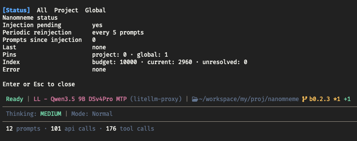
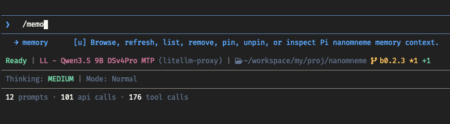
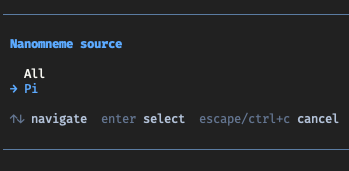
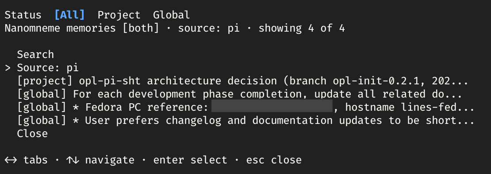
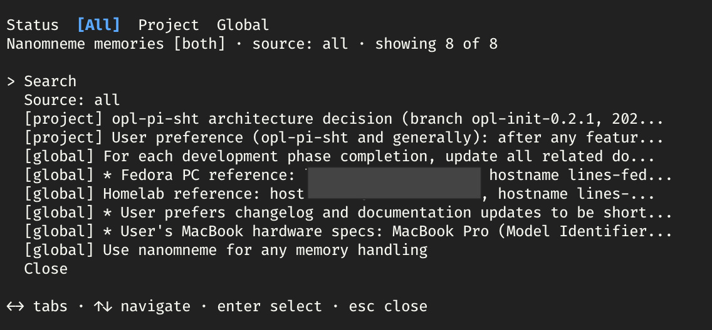

# @openlines/nmnm-pi

<div align="center">

[](https://www.npmjs.com/package/@openlines/nmnm-pi) [](https://www.npmjs.com/package/@openlines/nmnm-pi)

[](https://github.com/linellazatin/nanomneme)

</div>

Pi package for the [nanomneme](https://nanomneme.openlines.dev) SQLite memory adapter. It imports `@openlines/nmnm-core` directly and never shells out to the CLI.

## Features

- **Native memory tools:** model-invoked retain, recall, retrieve, and remove operations over `nmnm-core`; project operations require Pi project trust, while global operations remain available in untrusted projects. Model-visible JSON is bounded to 50 KiB, with explicit summaries for oversized results.
- **Opt-in Logslines diagnostics:** enable the default in `~/.local/share/nanomneme/config.jsonc`, or override `logging.enabled` in user-level Pi `nmnm.jsonc` and run `/reload` to apply changes. The shared lazy logger appends privacy-bounded `logslines/v1` outcomes for model-facing 4R tools, browser mutations, and explicit `/memory` pin, unpin, and remove commands to `~/.local/share/nanomneme/logs/nmnm-pi.jsonl`. Navigation, read-only commands, and canceled removal are not logged. The core dependency includes the shared generated runtime, so installation does not fetch Logslines source.
- **Project and global memory:** explicit store selection with canonical records and no custom database-path parsing.
- **Bounded automatic context:** transient autoretention guidance and the first-prompt memory index share one configurable character budget; pinned entries come first, with recent active fallback, store and recorded-source labels, unresolved-pin reporting, and refresh after successful compaction or memory mutations.
- **Opt-in autoretention:** project/global JSONC rules guide the active model's `retain_memory` calls without a nested model, worker, or direct adapter write.
- **Adapter-owned configuration:** optional JSONC settings and separate JSON pin files, with project and global locations; pin mutations are serialized and atomically replaced.
- **Direct user controls:** `/memory refresh`, `status`, `list`, `remove`, `pin`, and `unpin` without model involvement; `status` reports injection state, autoretention, the effective index budget, current full-payload character count, and lifecycle metadata without exposing memory content.

  
- **Native memory browser:** `/memory` and `/memory browse` open a Pi TUI menu with `Status`, `All`, `Project`, and `Global` tabs. Record details use a native action dialog; returning preserves selection. Standard selection keys honor configured `tui.select.*` bindings; arrows and `h/j/k/l` support navigation. Non-TUI UI modes use native dialogs.

  

  

  
- **Readable list UX:** project-first combined listing, pagination, `[project]` and `[global]` labels, exact-store `*` pin markers, and 60-character previews; browser rows omit IDs, which remain in details.

  
- **Safety boundaries:** validated pin targets, serialized atomic pin updates, ambiguity-safe removal, soft-only slash removal, non-creating native reads, and durable unresolved pins.


## Quickstart

Version 0.4.1 targets Pi 0.87.0 or newer, verified through Pi 1.0.0, and Node.js 22.19 or newer. Install it globally with Pi:

```sh
pi install npm:@openlines/nmnm-pi
```

From a repository checkout, load it for one run:

```sh
pi -e ./adapters/pi/extensions/index.js
```

To add this checkout as a project-local Pi package:

```sh
pi install -l "$(pwd)/adapters/pi"
```

Pi settings and pins are adapter-owned files outside SQLite. First load creates neither: `nmnm.jsonc` is optional and user-authored, and `nmnm-pi.json` appears only after a pin change. New `retain_memory` entries record `metadata.source` as `"pi"`; ID-based patches preserve an existing source. In an untrusted Pi project, automatic context reads only global settings, pins, and memory. Model-facing project operations (e.g. model tools) are rejected, global operations continue, and explicit user `/memory` project commands remain available. Oversized successful tool results return valid bounded summary JSON without changing the canonical stored record. Optional `autoretention` only guides the active model's `retain_memory`; disabled-by-default `reinjection` can rebuild the same context every five user prompts. Retain scope selects the matching write store: omit it for project or use `scope: "global"` for global. The browser and `/memory list` can show all records or Pi-source records. The model-facing `remove_memory` tool and `/memory remove` are soft-only; irreversible purge remains an explicit CLI operation. Run `/memory` or `/memory browse` for the model-free custom browser: left/right changes Status, All, Project, and Global tabs. Record details remain in a native action dialog; search and source controls remain in each store tab. `/memory status` remains available for an on-demand card. Explicit list, refresh, pin, unpin, and soft-remove subcommands remain available.

This Pi adapter includes tool-boundary tests for Unicode search and malformed-text rejection, numeric-range validation, private first-use storage, and monotonic patch/restore timestamps. The adapter delegates these guarantees to core; CLI-only maintenance and transfer operations remain outside its API.

See the [Pi Adapter Manual](docs/PI_ADAPTER_MANUAL.md) for npm, Git, and local installation, tools, JSONC settings, pins, list and removal controls, native-read behavior, reinjection, and transient index lifecycle.
