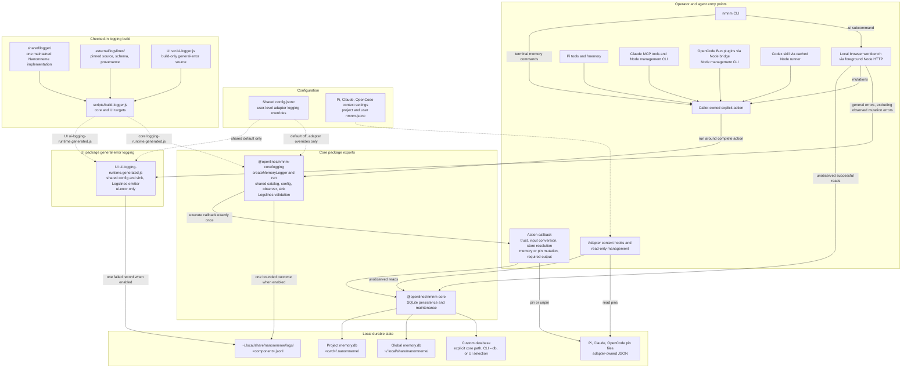
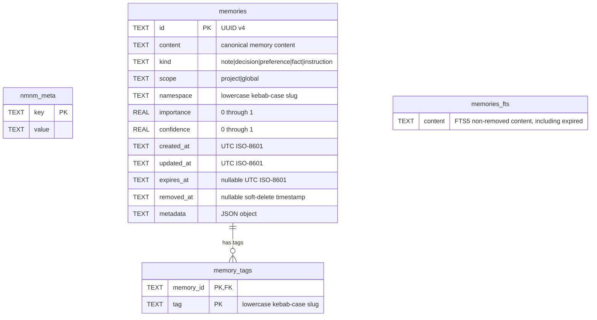

# Nanomneme Architecture

Nanomneme is a local, deterministic memory system. `nmnm-core` owns persistence and all SQLite access; the CLI, local review UI, and harness adapters call its public interface. Its separate `@openlines/nmnm-core/logging` export observes caller-owned explicit actions. Persistence methods and context reads do not automatically emit diagnostics; the UI binds the observer for mutations and a UI-only Logslines emitter for general errors.

## System architecture

### Ownership and runtime boundaries

- **Core:** [`packages/nmnm-core`](../packages/nmnm-core/) validates inputs, opens or migrates versioned databases, and performs reads and writes in SQLite transactions. Its persistence entry has no CLI parsing, harness behavior, logging policy, HTTP, MCP, embedding, or LLM-provider dependency. The additive `./logging` entry ships shared diagnostics without importing SQLite.
- **Clients:** the CLI and adapters select stores, map their host surfaces to core operations, and own their host-specific configuration. Project and global stores are separate SQLite files; the core also accepts an explicit path, which the CLI exposes as `--db`. A caller selects one store explicitly or composes project then global results where its interface supports both.
- **Local review UI:** [`packages/nmnm-ui`](../packages/nmnm-ui/README.md) serves packaged HTML/CSS/JavaScript from a foreground Node process on `127.0.0.1`. Explicit store registration opens existing databases read-only; per-store editing authorization enables writable core handles. Core `export()` supplies canonical snapshots for literal content search, source/lifecycle filtering, and globally ordered management pages. Mutations call `retain()` or `remove()` directly; no UI-owned SQL or adapter configuration. Mutations use the core logging observer; general errors use a UI-only bundled Logslines emitter. CLI bundles UI as a regular dependency and dynamically loads its shared foreground launcher for `nmnm ui`; normal terminal commands do not load UI.
- **Adapter state:** Pi, Claude, and OpenCode own their context settings and per-adapter pin JSON files, rendering enabled autoretention guidance before bounded memory indexes. Claude prompt-submit resolves policy first; disabled reinjection accesses no memory or session state, while enabled reinjection persists an ephemeral counter and builds context only on cadence. Pin/unpin actions use adapter file helpers without modifying SQLite. Pi serializes pin read-modify-replace updates with an exclusive same-directory lock; it never reclaims locks automatically, so a crash-left lock requires explicit operator removal after all writers stop. Codex has no pin or context settings; its user `nmnm.jsonc` is logging-only. Shared `~/.local/share/nanomneme/config.jsonc` sets the logging default; user-level adapter settings override it. Project settings cannot authorize logging.
- **Shared diagnostics:** `shared/logger/` owns the catalog, JSONC resolution, logical-action observer, and file sink. Core ships this implementation and the pinned Logslines emitter together as one deployed logging module in `logging-runtime.generated.js`, exposed through `@openlines/nmnm-core/logging`. Caller bindings supply identity, user settings location, and normalized host correlation. `run` executes its callback exactly once, observes its result or exception when enabled, and preserves synchronous values, original promises, and original errors. Raw `open()` calls do not log.
- **Process routing:** Pi invokes core and logging directly. Claude's Node MCP server observes tools before MCP response formatting; its hooks and Node management CLI are separate processes. OpenCode's Bun plugins invoke a Node bridge for persistence and diagnostics; the management CLI runs directly under Node. Codex invokes its cached package-relative Node runner, whose core and parser dependencies must be physically included through local plugin preparation.
- **Claude distribution:** copied marketplace plugins install registry dependencies from the adapter-local npm lockfile, currently core `0.3.0` under a `^0.3.0` manifest range. Local in-place loading uses root workspace dependencies and checkout core `0.3.1`. A later core publication requires an explicit reviewed plugin-lock refresh and plugin version increase; it does not alter frozen cached installations.
- **External source lifecycle:** `external/logslines/` is a checked-in snapshot selected by upstream release tag, with per-file SHA-256 provenance. `shared/fixtures/logslines-release.json` independently pins the reviewed release and is excluded from runtime packages. `npm run logslines:update -- <tag>` validates and replaces the snapshot/provenance and fixture, refreshes stale core/UI runtimes, runs the suite, and checks standalone packages. Later failures retain updates for review. Focused `external:check` compares against upstream; `external:update` replaces only snapshot/provenance. Offline fixture checks run through `npm test`; CI, package installation, and package runtime do not fetch Logslines.

## Local review UI

### UI session and mutation boundaries

- Store registrations and editing authorization live in server memory; selection and drafts live in the browser tab. Restarting the server clears registrations and write authorization.
- A single Add store control opens an authenticated directory browser over the launcher's filesystem. Explicit directory reads list entries; selecting a file registers it in place without uploads or recursive discovery.
- Store removal unregisters the server-side handle, closes its reader/writer, and revokes editing authorization without deleting the database. Re-adding opens read-only. The browser can collapse Stores while retaining its added-store count, and scroll five visible memory previews independently within 50-record pages.
- Registration and editing authorization use read-only core verification to reject schema/SQLite integrity failures, including incomplete version-marker lookalikes. Filename extensions do not determine compatibility; other health-report issues remain available through CLI verification.
- HTTP requests use a per-launch credential, exact local Host/Origin checks, bounded JSON bodies, and an asset allowlist. Theme and tab-session credentials are stored in the browser; memory content is not persisted there.
- `(store, id)` identifies records. Combined reads sort by newest `updated_at`, then store path and ID; separate stores do not share an atomic snapshot.
- Editing patches only changed allowed fields and preserves scope/provenance. Removed entries require explicit restoration; expired entries cannot be soft-removed. Purge remains explicit.
- Pre-write timestamp comparison detects stale records but is not atomic with core mutation. Full exports impose proportional memory/read costs. See the UI README for limits and future features.

## SQLite data model

Each project or global memory store is an independent versioned SQLite database. The following ER diagram reflects the schema in [`packages/nmnm-core/src/index.js`](../packages/nmnm-core/src/index.js).

### Canonical and derived state

- `nmnm_meta` stores schema metadata. A newly created store contains `schema_version`; `open()` rejects unknown, invalid, or newer schema versions and migrates writable older stores.
- `memories` is canonical. `id` is a UUID; `metadata` is serialized JSON; `removed_at` implements reversible soft removal; and `expires_at` controls whether a record is active. A purge deletes the canonical row.
- `memory_tags` is derived from a memory’s normalized tag set. Its composite primary key prevents duplicate tags per memory, and `memory_id` is the schema’s database-enforced foreign key to `memories.id`.
- `memories_fts` is an FTS5 virtual table, not a foreign-key child. Core explicitly maintains it by SQLite `rowid`: retain/import inserts or refreshes an active memory’s content, soft removal deletes its index row, and `rebuildFts()` reconstructs it from non-removed canonical records, including expired rows. Here an active index entry means non-removed, not necessarily unexpired. Query retrieval joins it only when an FTS query is supplied and ranks matching rows with `bm25`.
- Core enables SQLite foreign keys and performs canonical writes, tag replacement, and FTS synchronization inside `BEGIN IMMEDIATE` transactions. This avoids treating direct SQLite writes as a supported integration surface.

## Persistence lifecycle

`retain` creates a UUID record or patches an existing one, clears `removed_at` on a patch, replaces its tag rows, and synchronizes FTS content. `recall` returns only active records. `retrieve` filters out removed records and, by default, expired records; it can filter by kind, scope, namespace, tags, source metadata, importance, confidence, and expiration state. `remove` is soft by default, removing the FTS entry while retaining canonical data for restoration; `--purge` removes tags and the canonical row permanently. `verify` checks SQLite integrity, schema shape, tag consistency, and FTS correspondence; `repair --rebuild-fts` rebuilds only the derived FTS index.

## Shared logging configuration and coverage

The [Logger manual](LOGGER.md#configuration-and-record-contract) owns configuration paths, correlation sources, record fields, permissions, and privacy rules. Diagnostics default off; raw error messages are not redacted. Core persistence methods do not emit records automatically.

- CLI observes recognized 4R, import/export, verify, and repair commands, including argument processing and output completion. Combined retrieval and repair produce one aggregate outcome.
- Adapters observe explicit 4Rs and supported management mutations. Context hooks, internal reads, navigation, read-only management, and canceled actions remain quiet. Host/schema rejection before dispatch is outside observation.
- OpenCode Node bridges own normal outcomes. A bridge spawn failure emits one host-side failed record; later transport errors do not replace a completed memory outcome.
- UI mutations use the shared `retain`/`remove` observer; general errors use a separate `ui.error` emitter. Each attempt rereads settings, and observed mutation errors are not duplicated.
- Model response formatting, refresh, and adapter protocol transport follow observation. Diagnostic failures preserve the action's result or original error.

Run `npm run validate` for read-only generation checks, tests, shipped-dependency audit, and installed-package validation. CI runs rendered Chromium checks in a separate blocking job. Use `npm run codex:update` for content-aware refresh of an existing enabled local Codex installation. Neither validation nor runtime fetches upstream Logslines.
