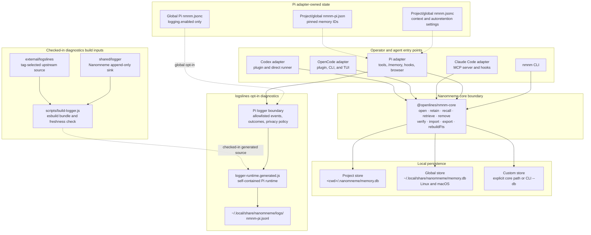
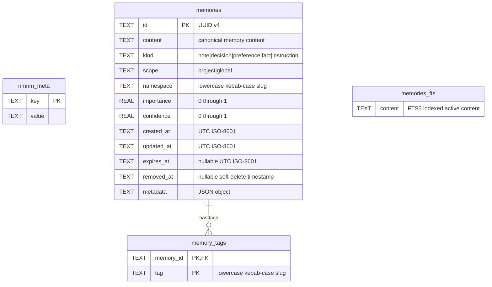

# Nanomneme Architecture

Nanomneme is a local, deterministic memory system. `nmnm-core` owns persistence and all SQLite access; the CLI and harness adapters call its public interface rather than writing SQLite directly or parsing one another’s output.

## System architecture

### Ownership and runtime boundaries

- **Core:** [`packages/nmnm-core`](../packages/nmnm-core/) validates inputs, opens or migrates versioned databases, and performs reads and writes in SQLite transactions. It has no CLI parsing, harness behavior, logging policy, HTTP, MCP, embedding, or LLM-provider dependency.
- **Clients:** the CLI and adapters select stores, map their host surfaces to core operations, and own their host-specific configuration. Project and global stores are separate SQLite files; the core also accepts an explicit path, which the CLI exposes as `--db`. A caller selects one store explicitly or composes project then global results where its interface supports both.
- **Pi configuration:** Pi uses `nmnm.jsonc` for settings and `nmnm-pi.json` for pins. Only the global Pi settings file may enable diagnostics. Project settings cannot authorize logging.
- **Pi diagnostics:** `adapters/pi/src/logger.js` owns the fixed event catalog, service identity, timing, session correlation, and privacy boundary. `shared/logger/` owns disabled-by-default emission and the Nanomneme JSONL file sink. The checked-in generated runtime contains both that shared behavior and Logslines validation/emission.
- **External source lifecycle:** `external/logslines/` is a checked-in snapshot selected by upstream release tag, with per-file SHA-256 values in `PROVENANCE.json`. `npm run external:check -- <tag>` fetches the selected release and compares its exact source and metadata with the checked-in snapshot; `npm run external:update -- <tag>` refreshes both. After an update, maintainers regenerate Pi’s runtime with `node scripts/build-logger.js` and update the pinned hashes in `test/external-logslines.test.js`. The offline hash test runs through `npm test` in CI; CI, package installation, and Pi runtime do not fetch Logslines.

## SQLite data model

Each project or global memory store is an independent versioned SQLite database. The following ER diagram reflects the schema in [`packages/nmnm-core/src/index.js`](../packages/nmnm-core/src/index.js).

### Canonical and derived state

- `nmnm_meta` stores schema metadata. A newly created store contains `schema_version`; `open()` rejects unknown, invalid, or newer schema versions and migrates writable older stores.
- `memories` is canonical. `id` is a UUID; `metadata` is serialized JSON; `removed_at` implements reversible soft removal; and `expires_at` controls whether a record is active. A purge deletes the canonical row.
- `memory_tags` is derived from a memory’s normalized tag set. Its composite primary key prevents duplicate tags per memory, and `memory_id` is the schema’s database-enforced foreign key to `memories.id`.
- `memories_fts` is an FTS5 virtual table, not a foreign-key child. Core explicitly maintains it by SQLite `rowid`: retain/import inserts or refreshes an active memory’s content, soft removal deletes its index row, and `rebuildFts()` reconstructs it from active canonical records. Query retrieval joins it only when an FTS query is supplied and ranks matching rows with `bm25`.
- Core enables SQLite foreign keys and performs canonical writes, tag replacement, and FTS synchronization inside `BEGIN IMMEDIATE` transactions. This avoids treating direct SQLite writes as a supported integration surface.

## Persistence lifecycle

`retain` creates a UUID record or patches an existing one, clears `removed_at` on a patch, replaces its tag rows, and synchronizes FTS content. `recall` returns only active records. `retrieve` filters out removed records and, by default, expired records; it can filter by kind, scope, namespace, tags, source metadata, importance, confidence, and expiration state. `remove` is soft by default, removing the FTS entry while retaining canonical data for restoration; `--purge` removes tags and the canonical row permanently. `verify` checks SQLite integrity, schema shape, tag consistency, and FTS correspondence; `repair --rebuild-fts` rebuilds only the derived FTS index.
