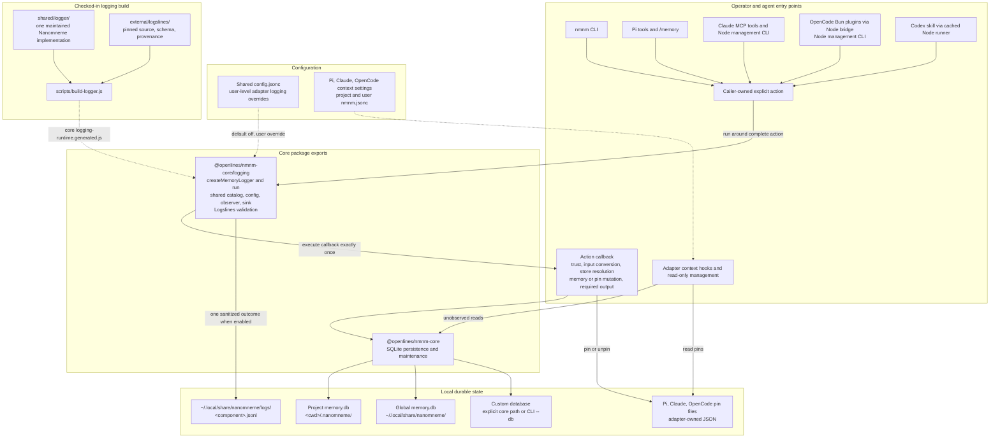
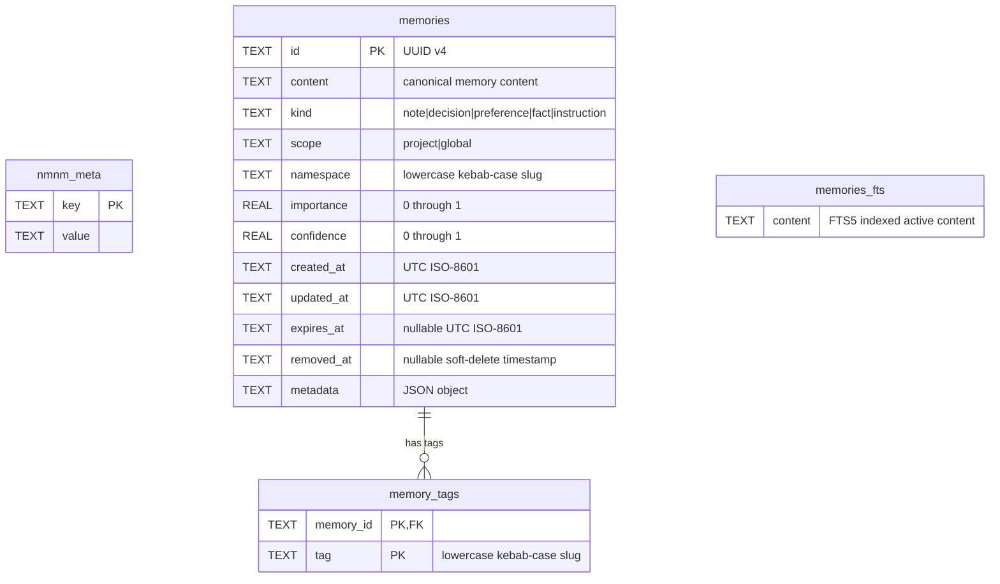

# Nanomneme Architecture

Nanomneme is a local, deterministic memory system. `nmnm-core` owns persistence and all SQLite access; the CLI and harness adapters call its public interface. Its separate `@openlines/nmnm-core/logging` export observes caller-owned explicit actions. Persistence methods and context reads do not automatically emit diagnostics.

## System architecture

### Ownership and runtime boundaries

- **Core:** [`packages/nmnm-core`](../packages/nmnm-core/) validates inputs, opens or migrates versioned databases, and performs reads and writes in SQLite transactions. Its persistence entry has no CLI parsing, harness behavior, logging policy, HTTP, MCP, embedding, or LLM-provider dependency. The additive `./logging` entry ships shared diagnostics without importing SQLite.
- **Clients:** the CLI and adapters select stores, map their host surfaces to core operations, and own their host-specific configuration. Project and global stores are separate SQLite files; the core also accepts an explicit path, which the CLI exposes as `--db`. A caller selects one store explicitly or composes project then global results where its interface supports both.
- **Adapter state:** Pi, Claude, and OpenCode own their context settings and per-adapter pin JSON files. Pin/unpin actions use adapter file helpers without modifying SQLite. Pi serializes pin read-modify-replace updates with an exclusive same-directory lock; it never reclaims locks automatically, so a crash-left lock requires explicit operator removal after all writers stop. Codex has no pin or context settings; its user `nmnm.jsonc` is logging-only. Shared `~/.local/share/nanomneme/config.jsonc` sets the logging default; user-level adapter settings override it. Project settings cannot authorize logging.
- **Shared diagnostics:** `shared/logger/` owns the catalog, JSONC resolution, logical-action observer, and file sink. Core ships this implementation and the pinned Logslines emitter together as one deployed logging module in `logging-runtime.generated.js`, exposed through `@openlines/nmnm-core/logging`. Caller bindings supply identity, user settings location, and normalized host correlation. `run` executes its callback exactly once, observes its result or exception when enabled, and preserves synchronous values, original promises, and original errors. Raw `open()` calls do not log.
- **Process routing:** Pi invokes core and logging directly. Claude's Node MCP server observes tools before MCP response formatting; its hooks and Node management CLI are separate processes. OpenCode's Bun plugins invoke a Node bridge for persistence and diagnostics; the management CLI runs directly under Node. Codex invokes its cached package-relative Node runner, whose core and parser dependencies must be physically included through local plugin preparation.
- **External source lifecycle:** `external/logslines/` is a checked-in snapshot selected by upstream release tag, with per-file SHA-256 values in `PROVENANCE.json`. `npm run external:check -- <tag>` fetches the selected release and compares its exact source and metadata with the checked-in snapshot; `npm run external:update -- <tag>` refreshes both. After an update, maintainers regenerate core’s logging runtime with `node scripts/build-logger.js` and update the pinned hashes in `test/external-logslines.test.js`. The offline hash test runs through `npm test` in CI; CI, package installation, and package runtime do not fetch Logslines.

## SQLite data model

Each project or global memory store is an independent versioned SQLite database. The following ER diagram reflects the schema in [`packages/nmnm-core/src/index.js`](../packages/nmnm-core/src/index.js).

### Canonical and derived state

- `nmnm_meta` stores schema metadata. A newly created store contains `schema_version`; `open()` rejects unknown, invalid, or newer schema versions and migrates writable older stores.
- `memories` is canonical. `id` is a UUID; `metadata` is serialized JSON; `removed_at` implements reversible soft removal; and `expires_at` controls whether a record is active. A purge deletes the canonical row.
- `memory_tags` is derived from a memory’s normalized tag set. Its composite primary key prevents duplicate tags per memory, and `memory_id` is the schema’s database-enforced foreign key to `memories.id`.
- `memories_fts` is an FTS5 virtual table, not a foreign-key child. Core explicitly maintains it by SQLite `rowid`: retain/import inserts or refreshes an active memory’s content, soft removal deletes its index row, and `rebuildFts()` reconstructs it from active canonical records. Query retrieval joins it only when an FTS query is supplied and ranks matching rows with `bm25`.
- Core enables SQLite foreign keys and performs canonical writes, tag replacement, and FTS synchronization inside `BEGIN IMMEDIATE` transactions. This avoids treating direct SQLite writes as a supported integration surface.

## Persistence lifecycle

`retain` creates a UUID record or patches an existing one, clears `removed_at` on a patch, replaces its tag rows, and synchronizes FTS content. `recall` returns only active records. `retrieve` filters out removed records and, by default, expired records; it can filter by kind, scope, namespace, tags, source metadata, importance, confidence, and expiration state. `remove` is soft by default, removing the FTS entry while retaining canonical data for restoration; `--purge` removes tags and the canonical row permanently. `verify` checks SQLite integrity, schema shape, tag consistency, and FTS correspondence; `repair --rebuild-fts` rebuilds only the derived FTS index.

## Shared logging configuration and coverage

Diagnostics default off. Shared `~/.local/share/nanomneme/config.jsonc` accepts `{ "logging": { "enabled": true } }` with comments and trailing commas. An absent adapter value inherits; explicit true or false in its user-level `nmnm.jsonc` overrides. Invalid shared or applicable adapter logging configuration disables that caller. Project settings cannot enable logging. Logging settings are resolved separately from context settings; unrelated root sections do not affect authorization.

The CLI logs recognized retain/recall/retrieve/remove/import/export/verify/repair commands, including argument processing and output completion. Combined retrieval and repair each produce one aggregate outcome. Pi, Claude, OpenCode, and Codex log explicit 4Rs; Pi and OpenCode browser mutations and Pi/Claude/OpenCode management pin/unpin/remove use the same catalog. Internal store reads, automatic context hooks, navigation, read-only adapter management, help/version, and canceled actions do not emit their own records. Only attempted actions reaching the observer are covered: host/schema rejection and OpenCode request-parse failures before dispatch have no terminal memory record; OpenCode bridge spawn failures emit one host-side failed record because the bridge never ran. Model response formatting, refresh, and adapter protocol transport follow the observed memory result; management callbacks can assemble messages within the action, but their output delivery follows it. The CLI includes output writing inside observation.

| Caller | User-level logging override | Session correlation | Configuration refresh |
|---|---|---|---|
| CLI | None; shared config only | Null | Each invocation |
| Pi | `<Pi agent directory>/nmnm.jsonc`, normally `~/.pi/agent/nmnm.jsonc` | Safe `ctx.sessionManager.getSessionId()` lookup, otherwise null | New logger instance on `/reload` or restart |
| Claude | `${CLAUDE_PLUGIN_DATA}/nmnm.jsonc`; fallback `~/.claude/nmnm.jsonc` when unset | Null in the current MCP/management wiring | Restart MCP for tools; each management invocation |
| OpenCode | `${XDG_CONFIG_HOME:-~/.config}/opencode/nmnm.jsonc` | Tool calls forward nonempty host `sessionID` through validated `diagnostic_context.session_id`; TUI and management CLI records are null | Each Node bridge or management invocation |
| Codex | `$CODEX_HOME/nmnm.jsonc`, default `~/.codex/nmnm.jsonc` | Nonempty `CODEX_THREAD_ID`, then `CODEX_SESSION_ID`, otherwise null | Each runner invocation |

The shared logger caches effective authorization on the first eligible invocation for that instance. Invalid applicable configuration disables that caller; an explicit adapter true cannot rescue an invalid shared file. Enabling logging creates neither a database nor a log file immediately. The first successful emission creates the component's log file; the sink applies `0700` to the log directory and `0600` to regular JSONL files. No historical logs, databases, or pin files require migration.

Logs remain in `~/.local/share/nanomneme/logs/<component>.jsonl`, where component is `nmnm-cli`, `nmnm-pi`, `nmnm-claude`, `nmnm-opencode`, or `nmnm-codex`. The observer may inspect callback results and exceptions transiently for classification. The emitted closed `logslines/v1` envelope contains fixed catalog fields, component/version identity, normalized session correlation, duration, empty attributes, and error summaries carrying the thrown error's message and class; it excludes memory content/IDs, queries, store paths, and stack traces. Every blocked outcome has null duration. Diagnostic failures suppress emission without changing the action, its result, or original error, and there is no stderr fallback. Model request fields cannot select diagnostic identity, configuration, or correlation. Direct core callers opt in explicitly with `createMemoryLogger().run({ operation, session_id: null }, observation => action())`.

Run `node scripts/check-logging-packages.js` to verify installed tarballs outside the workspace, including Codex's bundled core and JSONC parser. This is an explicit package check with npm registry access for ordinary dependencies; runtime and CI contract tests do not fetch Logslines. Older callers keep their previous behavior and must be upgraded to gain shared configuration and coverage.
