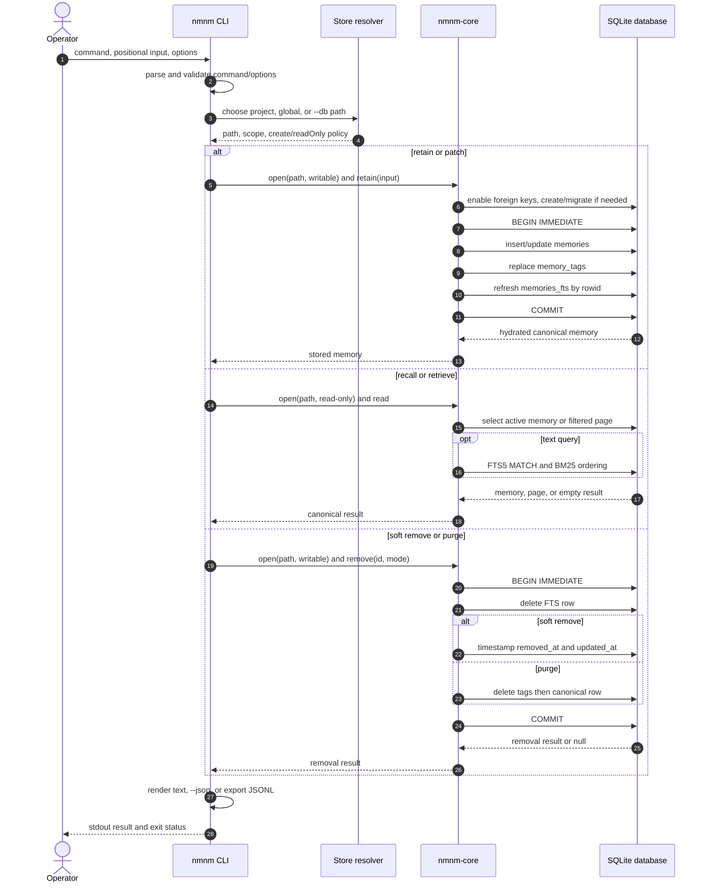
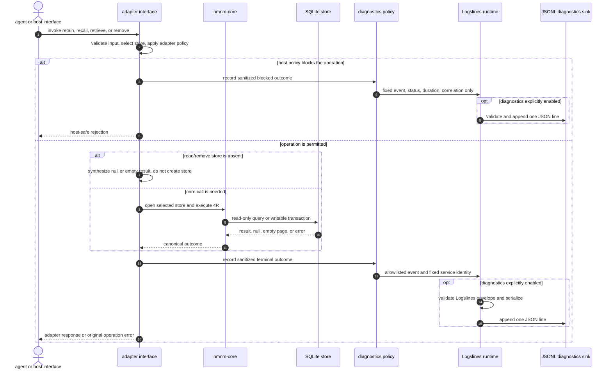
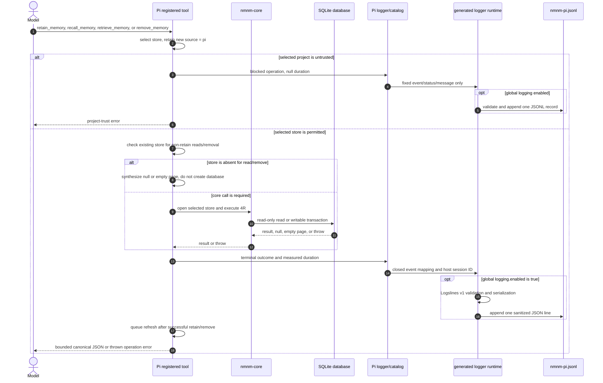
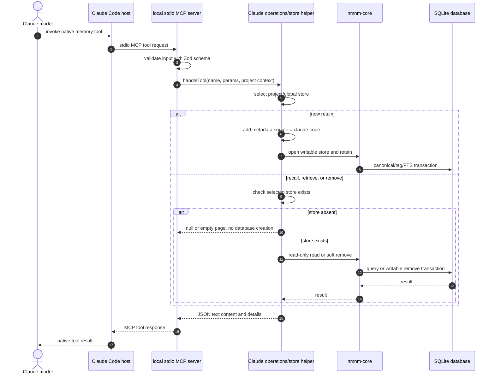
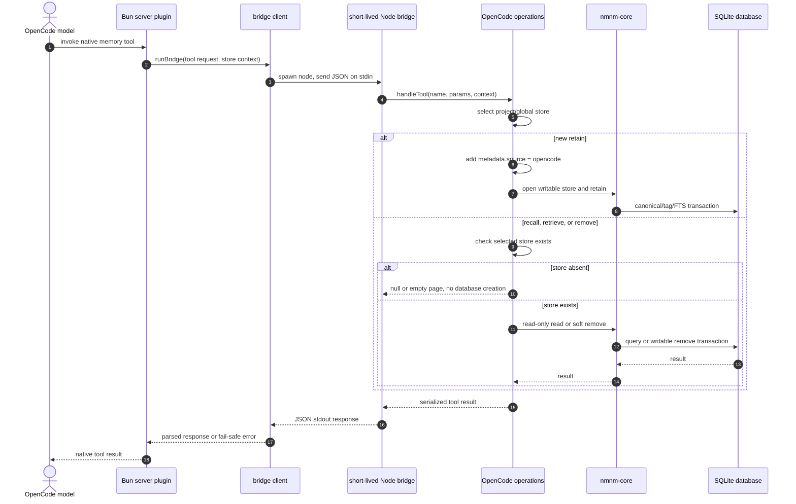
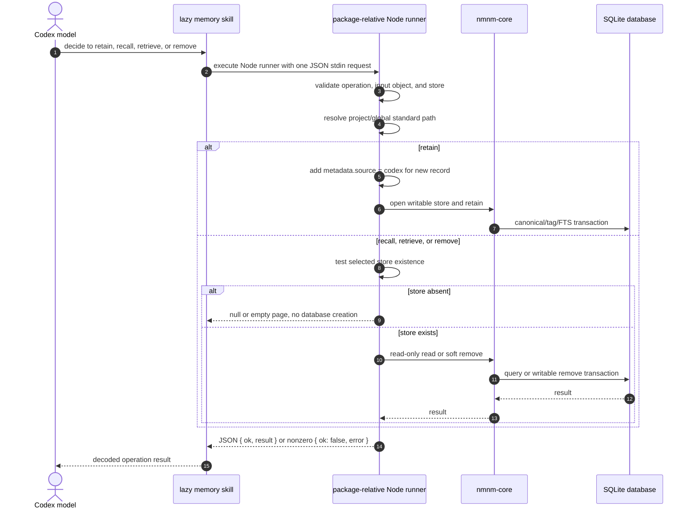

# End-to-End Memory Handling by Interface

This document follows the operational path of a memory request, not the package dependency graph. All interfaces ultimately use `@openlines/nmnm-core`; none is a supported path for direct SQLite writes. Pi is the only interface currently instrumented with Logslines diagnostics.

## Shared core behavior

Each individual core call targets one physical store; CLI `retrieve --both` composes a project call followed by a global call. Standard project storage is `<cwd>/.nanomneme/memory.db`; standard global storage is `~/.local/share/nanomneme/memory.db` on Linux and macOS. The CLI and direct core callers may also supply an explicit custom path. Core `open()` enables SQLite foreign keys and returns a store handle; when creating a new store, it initializes the schema, and writable opens apply forward migrations. Callers close the handle after the operation.

`retain` creates a UUID v4 record or patches a known ID. A retain transaction writes the canonical `memories` row, replaces normalized `memory_tags` rows, and synchronizes the FTS5 `memories_fts` row by SQLite rowid. A patch clears `removed_at`, thereby restoring a soft-removed memory. `recall` and `retrieve` operate on active records; reads are generally opened read-only by adapters to avoid creating a missing store. `remove` is soft by default: it removes the FTS row and timestamps the canonical row. Only the core API and CLI expose purge. `retrieve` joins FTS5 only when a text query exists and ranks within one database using BM25.

## `nmnm-cli`

**Implemented path:** `packages/nmnm-cli/bin/nmnm.js` parses command-line arguments, validates command-specific options, chooses the project, global, or explicit `--db` store, calls the core, then formats human-readable output, structured JSON, or canonical JSONL. `verify` and `export` open read-only; `repair` is writable and requires `--rebuild-fts`.

### CLI-specific boundaries

- `retain` derives scope from the standard project/global selector; custom `--db` retain requires an explicit `--scope project|global` record label.
- `retrieve --both` is the only composed operation: it retrieves project first, then global, preserves each item’s store provenance, and never compares BM25 scores across stores.
- Export writes all canonical records, including expired and soft-removed rows, as JSONL. It deliberately excludes FTS rows and returns no retrieval-only score/store fields.
- Import validates the complete canonical input before opening a new destination, then inserts the complete batch transactionally. Repair rebuilds only FTS-derived state.
- The CLI does not emit Logslines diagnostics.

## nmnm adapter 4Rs + diagnostics (logslines)

This is the high-level reference model for an adapter that exposes the four core operations and offers opt-in Logslines diagnostics. The adapter remains the policy boundary. It validates host input, selects a store, adds adapter-specific provenance only when appropriate, converts core results to the host response shape, and observes terminal outcomes for diagnostics.

Pi is the implemented (mature) example of this model. The other current adapters follow the core/store/response portion but do not yet instantiate the diagnostics-policy, Logslines-runtime, or JSONL-sink path. The diagram is a reusable architecture reference, as of the current and/or future state.

Diagnostics observe completed or blocked operations; they never supply memory behavior. The policy layer must receive only an allowlisted operation/outcome vocabulary, fixed messages, duration, and safe correlation metadata. It must not receive memory content, IDs, queries, paths, tags, raw input, raw host messages, responses, or raw errors. If configuration lookup, validation, serialization, sink creation, or append fails, the diagnostic attempt becomes a no-op. The adapter returns the same result or throws the same original operation error it would have produced with diagnostics disabled.

## Pi adapter

**Implemented path:** `adapters/pi/src/tools.js` registers the four model-facing tools. It maps retain scope or other-tool store parameters to the selected project/global store, rejects untrusted project operations, adds `metadata.source: "pi"` only on new retains, uses bounded tool responses, and queues a future context refresh after a successful retain/remove. `adapters/pi/src/logger.js` attempts to emit one terminal diagnostic outcome per instrumented 4R execution when logging is enabled.

### Pi diagnostic boundary

Pi’s logger records the operation, normalized terminal status, fixed event/message, measured duration where meaningful, service identity, and the host session ID when available. It does **not** receive or emit memory content, IDs, queries, store names, paths, raw arguments, raw errors, model messages, or tool responses. Browser Pin/Unpin/Remove and explicit `/memory` Pin/Unpin/Remove use separate `browser_*` and `command_*` operations, but their event catalog remains owned by the same logger boundary.

The logger is lazy: the first attempted record creates a Pi logger that reads only global `<Pi agent directory>/nmnm.jsonc` `logging.enabled`. Missing, invalid, or project-local logging settings leave diagnostics disabled. The self-contained `logger-runtime.generated.js` validates through Logslines and appends to `~/.local/share/nanomneme/logs/nmnm-pi.jsonl`. Any session-ID lookup, logger, validation, serialization, sink, or write failure returns no record and must not change the memory result, thrown error, trust decision, notification, or refresh behavior.

Pi’s `session_start`, `session_compact`, and `before_agent_start` hooks separately maintain its bounded transient index. The index reads existing stores/settings/pins without creating them. Automatic context injection and session lifecycle events emit no diagnostics. `/memory` browser navigation, search, back/cancel, read-only commands, and canceled removals also emit no diagnostics.

## Claude Code adapter

**Implemented path:** Claude Code spawns the local stdio MCP server in `adapters/claude/mcp/server.js`. The server registers four Zod-shaped tools and delegates to `adapters/claude/src/operations.js`, which chooses the store and calls the shared store helper/core. New retains add `metadata.source: "claude-code"`; ID patches preserve existing metadata.

### Claude-specific boundaries

- The MCP process imports core directly. It does not invoke the CLI, parse CLI output, run a daemon, or send network traffic.
- The `SessionStart` command hook independently builds a bounded read-only project/global index and optional autoretention guidance as transient `additionalContext`; the disabled-by-default `UserPromptSubmit` hook handles periodic reinjection.
- The deterministic `bin/memory.js` management surface and `/nanomneme:memory` command use the same store/context helpers. Pins are Claude-specific files, not canonical SQLite state.
- Claude currently has no Logslines instrumentation.

## OpenCode adapter

**Implemented path:** OpenCode’s server and TUI plugins run under Bun, which cannot provide the core’s required `node:sqlite`. `adapters/opencode/src/bridge-client.js` therefore spawns a short-lived Node process for every core or context operation. `src/bridge.js` reads one JSON request from stdin, calls operations/context/browser code, and writes one JSON response to stdout. New retains add `metadata.source: "opencode"`.

### OpenCode-specific boundaries

- The Bun-side module graph does not import `@openlines/nmnm-core`; Node bridge processes own all core, SQLite, JSONC, pin, browser, and index imports.
- `experimental.chat.system.transform` invokes the same bridge for every non-empty model-request context to rebuild transient project/global memory context. OpenCode rebuilds the system prompt per request, so Pi/Claude-style cadence gating is not used.
- The optional TUI browser and `nmnm-opencode` CLI are model-free management surfaces. They call the same bridge or direct Node-side helpers, respectively; neither adds an MCP server or direct Bun-to-SQLite path.
- OpenCode currently has no Logslines instrumentation.

## Codex adapter

**Implemented path:** Codex receives one lazy-loaded `memory` skill. The package-relative `skills/memory/runner.js` imports the adapter runner, accepts one JSON request on stdin, invokes the core, and returns one JSON envelope. It supports only project/global 4Rs and soft removal. New retains add `metadata.source: "codex"`.

### Codex-specific boundaries

- Codex supports no arbitrary database path, purge, import, export, verify, repair, adapter settings, pins, autoretention, or management CLI. Those remain core/CLI or other-adapter concerns.
- Its trusted `SessionStart` hook is a separate read-only path that opens existing stores only, emits no index for empty/unreadable stores, and applies a fixed 1,200-character cap.
- Codex currently has no Logslines instrumentation.

## Cross-interface comparison

| Interface | Host-to-core route | New-record provenance | Missing-store read/remove behavior | Context/index path | Management surface | Logslines diagnostics |
|---|---|---|---|---|---|---|
| `nmnm-cli` | Node CLI directly imports core | Caller-controlled metadata | Command/store semantics; no implicit fallback | None | CLI itself | None |
| Pi | Pi extension directly imports core | `"pi"` | `null` for recall/remove; empty page for retrieve; no creation | Hooks build bounded next-prompt index | `/memory` command and browser | Yes: model 4Rs plus browser/command mutations when globally enabled |
| Claude Code | Local stdio MCP server directly imports core | `"claude-code"` | `null` for recall/remove; empty page for retrieve; no creation | SessionStart and optional UserPromptSubmit hooks | `bin/memory.js` and `/nanomneme:memory` | None |
| OpenCode | Bun plugin → short-lived Node bridge → core | `"opencode"` | `null` for recall/remove; empty page for retrieve; no creation | Per-request system transform through bridge | `nmnm-opencode` CLI and optional TUI | None |
| Codex | Lazy skill → package-relative Node runner → core | `"codex"` | `null` for recall/remove; empty page for retrieve; no creation | Read-only SessionStart hook | None | None |

## Dev notes

- The diagrams intentionally show the normal 4R path and the most consequential missing-store/trust branch. They do not model every validation exception, configuration parse failure, or UI selection state.
- The core transaction labels group several SQL statements into one semantic step. The authoritative physical schema, constraints, and derived-state details remain in [`docs/ARCHITECTURE.md`](../docs/ARCHITECTURE.md) and `packages/nmnm-core/src/index.js`.
- Pi’s diagnostic path is deliberately shown after the terminal operation outcome is known. The logger must observe, not control, memory behavior.
