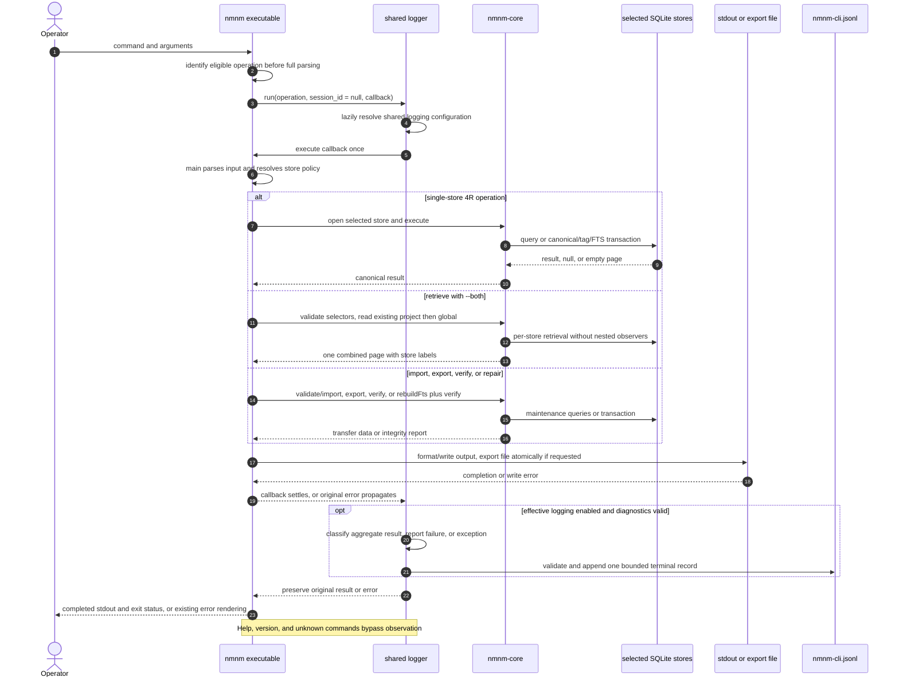
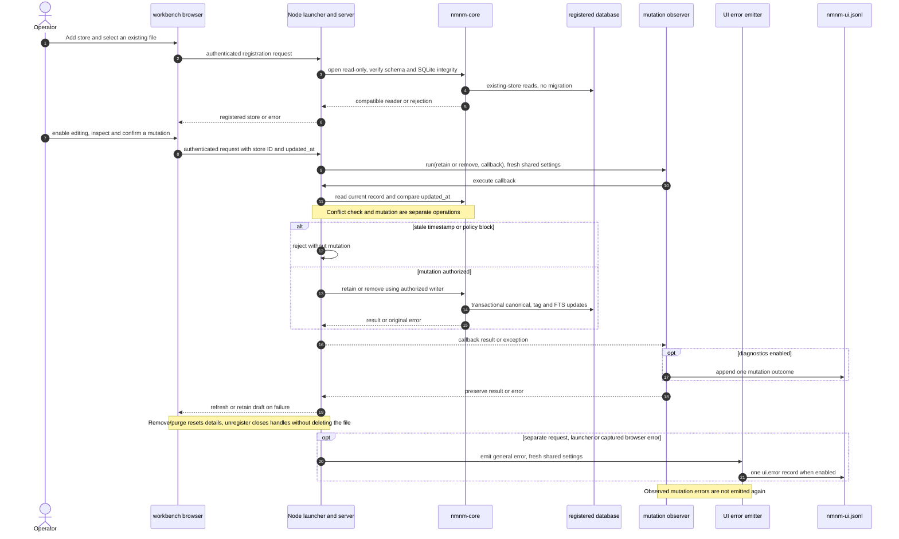
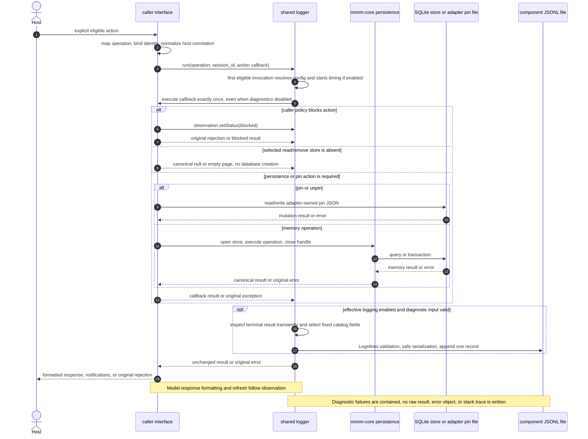
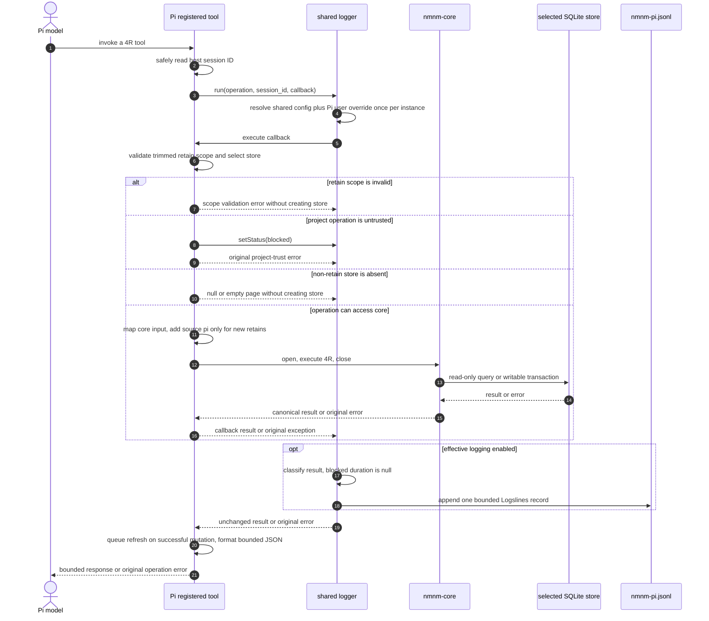
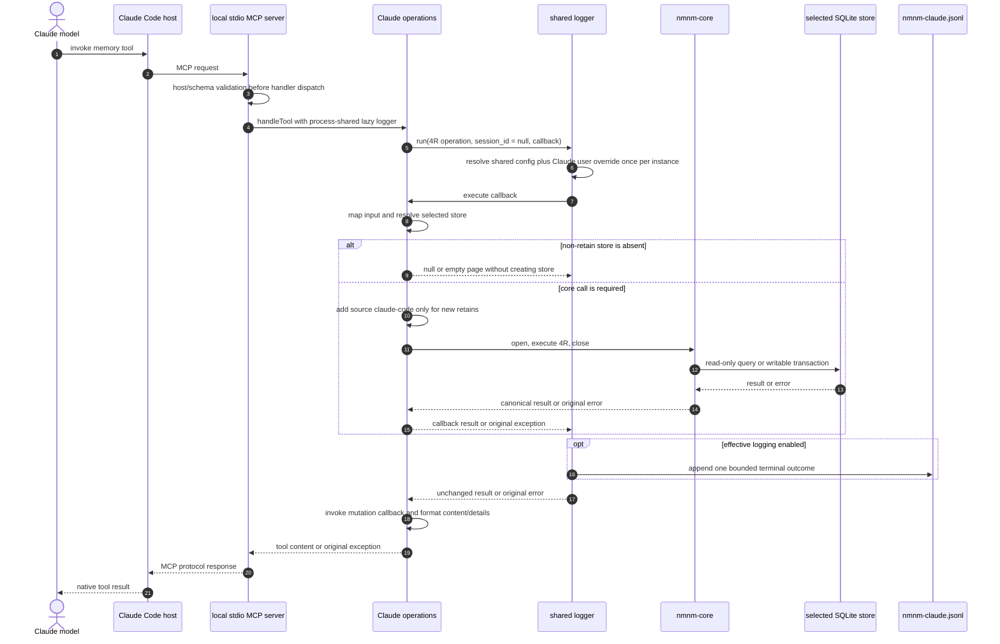
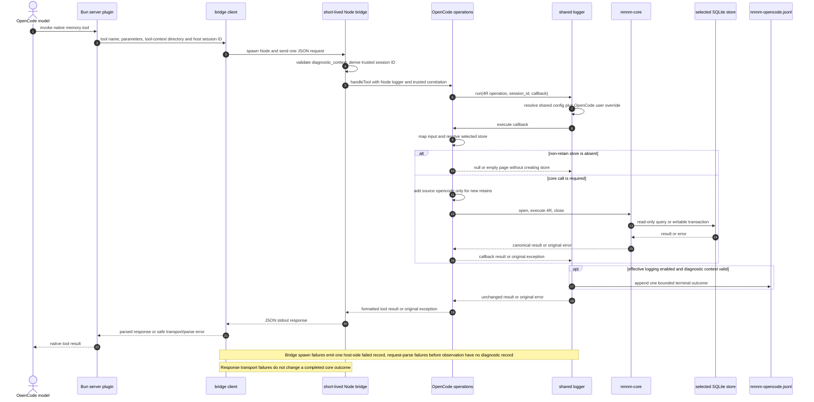
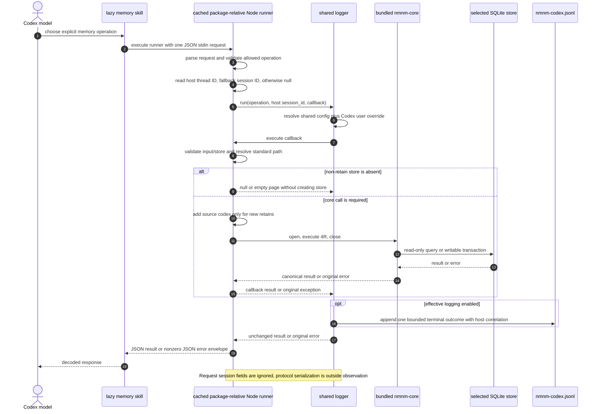

# End-to-End Memory Handling by Interface

This document follows memory requests, management mutations, and their diagnostic outcomes. SQLite access goes through `@openlines/nmnm-core`. The CLI, UI mutations, and adapters surround eligible explicit actions with `@openlines/nmnm-core/logging`; persistence methods and context reads remain uninstrumented. The observer participants below are the same shared implementation shipped with core, instantiated with each caller's identity and user configuration path.

## Shared core behavior

Each individual core call targets one physical store; CLI `retrieve --both` composes a project call followed by a global call. Standard project storage is `<cwd>/.nanomneme/memory.db`; standard global storage is `~/.local/share/nanomneme/memory.db` on Linux and macOS. The CLI and direct core callers may also supply an explicit custom path. Core `open()` enables SQLite foreign keys and returns a store handle; when creating a new store, it initializes the schema, and writable opens apply forward migrations. CLI/adapter callers generally close handles after operations; the UI retains readers until unregistration or shutdown and closes writers when editing is disabled, a store is unregistered, or the server stops. Write transactions acquire targets before patching, capture mutation results before commit, and keep canonical rows, tags, and FTS atomic. Reads use one database snapshot; lock waiting is bounded to five seconds. New POSIX stores request private modes; writable opens enable SQLite deletion protection and successful write transactions enable FTS5 deletion protection. Per-record update timestamps strictly advance. See the [Core and CLI Manual](CORE_CLI_MANUAL.md) for search, permissions, timestamp, and deletion guarantees and their limits.

`retain` creates a UUID v4 record or patches a known ID. A retain transaction writes the canonical `memories` row, replaces normalized `memory_tags` rows, and synchronizes the FTS5 `memories_fts` row by SQLite rowid. A patch clears `removed_at`, thereby restoring a soft-removed memory. `recall` returns active records; `retrieve` excludes removed records and can explicitly select expired records; reads are generally opened read-only by adapters to avoid creating a missing store. `remove` is soft by default: it removes the FTS row and timestamps the canonical row. The core API, CLI, and local review UI expose purge; adapter removal remains soft-only. `retrieve` joins FTS5 only when a text query exists and ranks within one database using BM25.

## `nmnm-cli`

**Implemented path:** the executable calls `executeCli` in `packages/nmnm-cli/bin/nmnm.js`. It identifies an eligible command before full argument parsing and observes the complete asynchronous command callback: synchronous `main()` processing, store work, output formatting, and stdout write completion. `main()` itself retains its synchronous interface and does not independently log. `verify` and `export` open existing stores read-only; `repair` opens an existing store writable and requires `--rebuild-fts`. Ordinary single-store 4Rs currently open writable/create-capable stores, including recall/retrieve/remove; their missing-store behavior differs from adapter shortcuts.

### CLI-specific boundaries

- CLI trims and validates scope before opening a database. `retain` derives scope from the standard project/global selector and rejects mismatches; custom `--db` retain requires an explicit `--scope project|global` record label.
- `retrieve --both` composes retrieval across existing stores: project first, then global, with store provenance preserved and no comparison of BM25 scores across databases. Repair composes rebuild plus verification; each complete CLI command has one observed outcome.
- Export writes all canonical records, including expired and soft-removed rows, as JSONL. It deliberately excludes FTS rows and returns no retrieval-only score/store fields.
- Import validates the complete canonical input before opening a new destination, then inserts the complete batch transactionally. Repair rebuilds only FTS-derived state.
- The CLI attempts one opt-in terminal record for a recognized 4R/import/export/verify/repair command, including invalid eligible arguments, integrity-report failure, and output-writing failure. Export file replacement occurs inside `main()`; stdout completion occurs inside `executeCli`. No success is recorded before required writing completes. Internal validation stores and combined per-store reads do not emit separately; help/version/unknown commands bypass the observer. Logging does not contaminate stdout JSON or export JSONL.

## `nmnm-ui`

**Implemented path:** `packages/nmnm-ui/bin/nmnm-ui.js` and `nmnm ui` share the UI package launcher, which starts a foreground loopback server and opens the default browser unless `--no-auto` or `-na` is supplied. The credential URL is always printed; opener failure leaves the server running. Packaged browser JavaScript sends authenticated requests to the Node server, which imports core directly. The UI observes edit/expiry/restore as `retain` and remove/purge as `remove`. General request, launcher, and browser errors emit `ui.error` through a UI-only bundled emitter. Successful reads, navigation, canceled actions, and empty patches remain quiet; errors already observed as mutations are not emitted again.

1. Open Add store and browse the launcher machine's filesystem through authenticated directory-list requests. Select a database file; resolve its real path and deduplicate registrations. Open with `create: false, readOnly: true`; missing or incompatible stores fail without creation or migration. The file is opened in place, not uploaded.
2. Export canonical snapshots from selected read-only handles. Derive source choices, apply lifecycle and exact structured filters plus literal content search, sort by update time/store path/ID, and return a 50-record page. Detail reads use the same export API, including removed records.
3. Enable editing for one registered store; repeat read-only schema/SQLite integrity validation, then open a writable core handle with `create: false`. Authorization lasts for the server session, and disabling editing closes that writer.
4. Before mutation, export the current record through the writer and compare `updated_at` with the browser's submitted value. Reject detected conflicts without discarding the browser draft; the check is not atomic with the following core call.
5. Apply allowed changed fields through `retain()`, restore through an explicit ID-only retain, or call `remove()` for confirmed soft removal/purge. Preserve scope and metadata; prevent editing removed records and soft-removing expired records.
6. Refresh the memory list after success. Removal/purge clears memory selection and resets details to their initial prompt; edits/restores refresh details. Browser interactions remain inert while requests run; navigation asks before discarding unsaved edits. Store removal separately unregisters and closes its reader/writer without deleting the database, then returns focus to Add store after the browser becomes interactive. Shutdown closes remaining handles and the HTTP server.

- API access uses a per-launch credential and exact local Host/Origin validation. Only registered store IDs identify mutation destinations.
- Registration verifies required Nanomneme tables/columns, FTS structure, and SQLite integrity before publishing a store handle. Unrelated SQLite and incomplete version-marker lookalikes fail without mutation; extensions are not identity checks.
- Separate stores are read independently; full exports incur proportional memory/read costs. Search is literal, without FTS ranking or Boolean syntax.
- The UI manages existing memories only: no creation, import/export controls, repair, bulk operations, adapter pins/settings, or context injection. See the [UI README](../packages/nmnm-ui/README.md) for features and limitations.

## Shared action observation and diagnostics

Each caller maps its surface to a closed operation name, supplies identity/configuration/correlation through its binding, and invokes `logger.run` with the complete action callback. The shared observer resolves configuration lazily, executes that callback exactly once even when diagnostics are disabled, and observes its returned value, original exception, or asynchronous settlement. It does not intercept raw core methods or start nested records for internal reads.

The following diagram is the implemented common pattern. Callback work varies by surface: model 4Rs include store presence checks, input conversion, opening, and execution; management includes target resolution and pin/memory mutation. Host schema validation and unknown-operation dispatch can reject before the observer. Caller-specific diagrams below show those entry points.

When enabled, the observer inspects canonical callback results transiently to classify outcomes: null recall/remove is `not_found`, zero-result retrieve is `empty`, and failed verify/repair reports are `failed`. Management callbacks can mark `not_found` or `blocked` explicitly. Exceptions are `failed` unless explicitly blocked. All blocked durations are null; other durations cover the observed callback and exclude logging work. The emitted envelope contains fixed catalog fields, identity, normalized session ID, duration, empty attributes, and failure summaries whose `error.message` carries the thrown error verbatim (falling back to the fixed catalog message when none is usable), with derived `error.kind` and `cause_kind`. It does not serialize memory-result payloads, host objects, or stack traces. Thrown error messages are not redacted and may include sensitive input, IDs, queries, or paths. Configuration, clock, validation, and sink failures suppress diagnostics and preserve execution; invalid diagnostic inputs suppress the record. No-op logging still runs the callback. See the authoritative [catalog](../shared/logger/catalog.js) and [observer](../shared/logger/index.js).

Shared `~/.local/share/nanomneme/config.jsonc` defaults logging off; user-level adapter `nmnm.jsonc` overrides only explicit booleans. Either invalid applicable configuration disables the caller, and project settings cannot authorize logging. Each shared logger instance caches the decision on its first eligible attempt; UI creates a fresh instance per mutation or general error. Pi `/reload` creates a fresh instance; Claude tools share an MCP-process instance; CLI, management commands, OpenCode bridges, and Codex runners resolve through their per-process instances. The first emitted record creates `logs/<component>.jsonl`; logs use owner-only permissions and remain separate from memory databases and pin JSON. The [Logger manual](LOGGER.md#configuration-and-record-contract) lists exact override paths and correlation sources.

## Pi adapter

**Implemented path:** `adapters/pi/src/tools.js` safely obtains the current host session ID and starts observation. Inside the callback, retain scope is trimmed and validated before selecting a store; other tools use their store selector. Project trust checks, missing-store shortcuts, input conversion, and core calls follow. Invalid scope emits a failed outcome when diagnostics are enabled and never creates a store. New retains add `metadata.source: "pi"`; ID patches preserve source when metadata is omitted. Bounded tool response formatting and future context refresh happen after observation succeeds. Pi tools and session management share a lazy logger from `adapters/pi/src/session.js`.

### Pi diagnostic boundary

Pi passes normalized correlation from `ctx.sessionManager.getSessionId()` on each action, using null if absent, invalid, or throwing. The shared observer sees the callback result transiently, but emits only the common bounded envelope. Browser Pin/Unpin/Remove and explicit `/memory` Pin/Unpin/Remove use separate `browser_*` and `command_*` operations in the shared catalog. Pin files remain Pi-owned JSON outside SQLite.

Logger construction precedes registration; configuration resolution is lazy on the first eligible invocation. Shared authorization and the user-level `<Pi agent directory>/nmnm.jsonc` override follow the common precedence rules. Enabled outcomes append to `~/.local/share/nanomneme/logs/nmnm-pi.jsonl` through core's generated runtime. Browser Remove preflight emits no record when its target is already inactive, confirmation succeeds, or the user cancels; preflight exceptions can emit a failed outcome. A confirmed mutation starts a separate observation after confirmation, excluding decision time. Notifications and refresh remain outside mutation observation.

Pi’s `session_start`, `session_compact`, and `before_agent_start` hooks separately maintain its bounded transient index. The index reads existing stores/settings/pins without creating them. Automatic context injection and session lifecycle events emit no diagnostics. `/memory` browser navigation, search, back/cancel, read-only commands, and canceled removals also emit no diagnostics.

## Claude Code adapter

**Implemented path:** Claude Code spawns `adapters/claude/mcp/server.js`, which registers four schema-shaped tools and one process-shared lazy logger. Host/schema validation precedes handler dispatch. `src/operations.js` observes core input conversion, store resolution/presence checks, and execution; new retains add `metadata.source: "claude-code"` and ID patches preserve source when metadata is omitted. The shared outcome is selected before formatting content/details or serializing MCP responses.

### Claude-specific boundaries

- The MCP process imports core directly. It does not invoke the CLI, parse CLI output, run a daemon, or send network traffic.
- The `SessionStart` command hook independently builds transient `additionalContext` with optional autoretention guidance before the bounded read-only project/global index. `UserPromptSubmit` resolves settings before any session-state or memory access: disabled policy stops there; enabled policy advances an ephemeral counter and builds context only on cadence. Context failures emit nothing but advance the enabled count; invalid settings leave state untouched.
- The deterministic `bin/memory.js` management surface and `/nanomneme:memory` command use the same store/context helpers. Pins are Claude-specific files, not canonical SQLite state.
- Explicit tools append one opt-in terminal record to `nmnm-claude.jsonl` through the shared observer. Management pin/unpin/remove uses `command_*`; ambiguous targets are blocked and missing targets are not_found. Read-only management, schema rejection before dispatch, and context hooks remain unlogged. Current tool/management correlation is null. Restart the MCP process to refresh its cached logging settings.

## OpenCode adapter

**Implemented path:** OpenCode's server and TUI plugins run under Bun and use `adapters/opencode/src/bridge-client.js` to spawn a short-lived Node process. `src/bridge.js` parses one JSON request, validates an optional separate diagnostic context, and dispatches tools to `handleTool` or mutations to `mutate`. These Node helpers own shared logging; the bridge does not add a second observer. New retains add `metadata.source: "opencode"`. The bridge formats its JSON stdout response after the memory/mutation outcome has been observed.

### OpenCode-specific boundaries

- The Bun host imports the sqlite-free `@openlines/nmnm-core/logging` subpath for spawn-failure diagnostics; Node bridge processes own core persistence, SQLite, pins, and index operations.
- `experimental.chat.system.transform` invokes the same bridge for every non-empty model-request context to rebuild transient project/global memory context. OpenCode rebuilds the system prompt per request, so Pi/Claude-style cadence gating is not used.
- The optional TUI browser and `nmnm-opencode` CLI are model-free management surfaces. They call the same bridge or direct Node-side helpers, respectively; neither adds an MCP server or direct Bun-to-SQLite path.
- Tools use the shared 4R catalog; Node `mutate` uses `browser_*` and the direct Node management CLI uses `command_*`. Enabled outcomes append to `nmnm-opencode.jsonl`. Index/status/browse/detail requests and canceled TUI removal do not emit records. The Bun server plugin forwards the tool-context session ID as `diagnostic_context.session_id` and resolves the project store from the tool-context directory; the model-free TUI and CLI management surfaces carry no host session, so their correlation stays null. The bridge accepts a nullable/nonempty session ID separately from model parameters. Malformed diagnostic context suppresses emission without stopping the memory action. Bridge spawn failures emit one `failed` record from the Bun plugin host itself, carrying the spawn error verbatim, because the bridge and its observer provably never ran; request parsing and rejection before observation have no memory diagnostic; later response transport/parse failure does not replace a completed memory outcome.

## Codex adapter

**Implemented path:** Codex's lazy-loaded memory skill invokes the cached package-relative `skills/memory/runner.js`. `scripts/runner.js` parses stdin and formats the protocol envelope outside observation. `src/runner.js` validates the request object and allowed operation, reads normalized host correlation, then observes input/store validation, path resolution, missing-store shortcuts, and core execution. New retains add `metadata.source: "codex"`; ID patches preserve source. Local marketplace preparation includes physical core/parser dependencies so the cached runner imports the same logging implementation.

### Codex-specific boundaries

- Codex supports no arbitrary database path, purge, import, export, verify, repair, context settings, pins, autoretention, or management CLI. Its user-level `nmnm.jsonc` supports the logging override only; transfer/repair remain CLI operations; existing-record cleanup is also available in the separate UI workbench.
- Its trusted `SessionStart` hook is a separate read-only path that opens existing stores only, emits no index for empty/unreadable stores, and applies a fixed 1,200-character cap.
- Codex observes explicit 4Rs through the shared logger, using host `CODEX_THREAD_ID` with `CODEX_SESSION_ID` fallback and null when absent. Request-supplied session fields are ignored; the SessionStart hook remains unlogged.

## Management and context flows

| Surface | Observed callback | Catalog operations | Unlogged work or post-action delivery |
|---|---|---|---|
| Pi browser | Pin/unpin target check and pin write; confirmed soft remove | `browser_pin`, `browser_unpin`, `browser_remove` | Navigation, successful preflight/confirmation, cancellation, notification, refresh |
| Pi `/memory` | Mutation target resolution and pin/soft-remove action | `command_pin`, `command_unpin`, `command_remove` | Status/list/refresh, response notification, context rebuild |
| Claude management | Qualified/unqualified target resolution and pin/soft-remove action | `command_pin`, `command_unpin`, `command_remove` | Invalid command usage, status/list/search/show, final text/protocol relay |
| OpenCode TUI | Node bridge mutation target check and pin/soft-remove action | `browser_pin`, `browser_unpin`, `browser_remove` | Bun-side confirmation/cancellation, browse/detail/index reads, UI refresh |
| OpenCode management | Node CLI target resolution and pin/soft-remove action | `command_pin`, `command_unpin`, `command_remove` | Invalid command usage, status/list/search/show, final text output |

Pin/unpin touches each adapter's JSON pin file; soft remove calls core and leaves matching pins configured until explicitly unpinned. Pi pin mutations take an exclusive same-directory lock, reread while held, and atomically replace the file; a lock is never reclaimed automatically, so a crash-left lock requires manual removal after all writers stop. Target resolution may perform several core reads, but only the outer mutation is observed. A missing target yields the catalog's not_found outcome where supported; ambiguous command targets yield blocked for the implemented resolving surfaces. Codex has no management mutation surface. Pi/Claude context hooks, OpenCode's per-request context bridge, and Codex's read-only SessionStart index call core directly without an observer, so startup or prompt-time reads create no diagnostic records.

## Cross-interface comparison

| Interface | Host-to-core route | New-record provenance | Missing-store read/remove behavior | Context/index path | Management surface | Logslines diagnostics |
|---|---|---|---|---|---|---|
| `nmnm-cli` | Node CLI directly imports core | Caller-controlled metadata | Single-store 4Rs may create a store; `--both` skips absent stores | None | CLI itself | Yes: explicit commands, including maintenance and output completion |
| `nmnm-ui` | Browser → foreground Node HTTP server → core | No creation; existing metadata preserved | Explicit registration fails; no creation | None | Existing-record review, edit, expiry, remove, restore, purge | Opt-in mutations and general errors; successful reads remain quiet |
| Pi | Pi extension directly imports core | `"pi"` | `null` for recall/remove; empty page for retrieve; no creation | Hooks build bounded next-prompt index | `/memory` command and browser | Yes: model 4Rs and browser/command mutations under effective shared/user settings |
| Claude Code | Local stdio MCP server directly imports core | `"claude-code"` | `null` for recall/remove; empty page for retrieve; no creation | SessionStart and optional UserPromptSubmit hooks | `bin/memory.js` and `/nanomneme:memory` | Yes: explicit 4Rs and management mutations |
| OpenCode | Bun plugin → short-lived Node bridge → core | `"opencode"` | `null` for recall/remove; empty page for retrieve; no creation | Per-request system transform through bridge | `nmnm-opencode` CLI and optional TUI | Yes: Node operations and mutations; bridge spawn failures observed host-side, other pre-bridge failures unobserved |
| Codex | Lazy skill → package-relative Node runner → core | `"codex"` | `null` for recall/remove; empty page for retrieve; no creation | Read-only SessionStart hook | None | Yes: explicit 4Rs; no hook records |

## Dev notes

- The diagrams intentionally show the normal 4R path and the most consequential missing-store/trust branch. They do not model every validation exception, configuration parse failure, or UI selection state.
- The core transaction labels group several SQL statements into one semantic step. The authoritative physical schema, constraints, and derived-state details remain in [the architecture document](ARCHITECTURE.md) and [core source](../packages/nmnm-core/src/index.js).
- Each logger call surrounds the complete callback; emission follows its terminal result or exception. For asynchronous callbacks, `run` returns the original promise immediately and the record waits for settlement; diagrams group those steps into the terminal outcome. Error arrows group thrown/rejected errors with normal returns for readability. Logger internals combine the catalog, configuration resolver, Logslines emitter, and sink within one generated module. Adapter response serialization lies outside observation; CLI output completion lies inside it.
