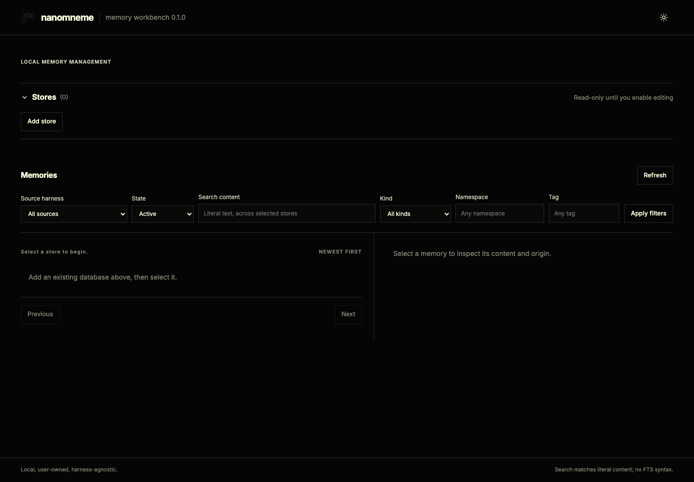
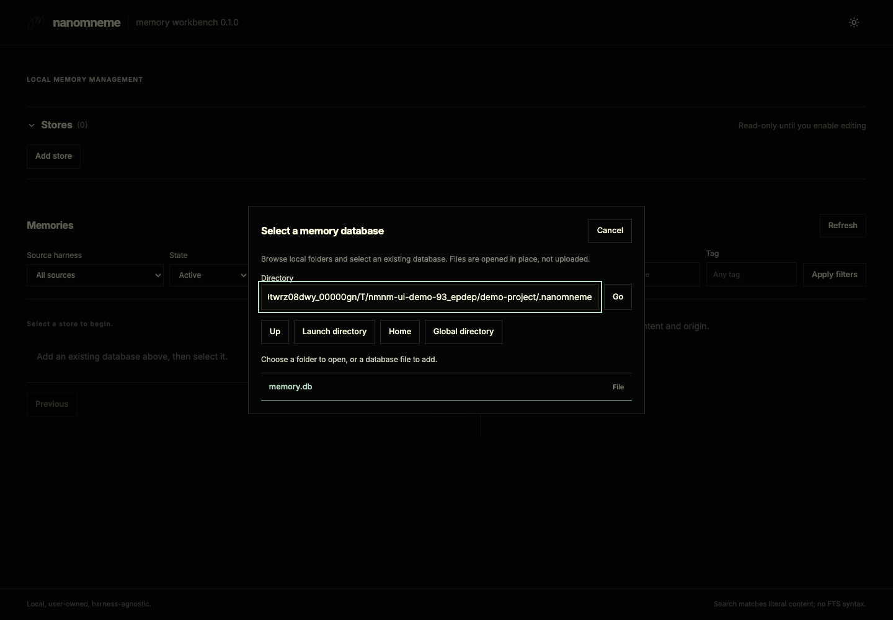
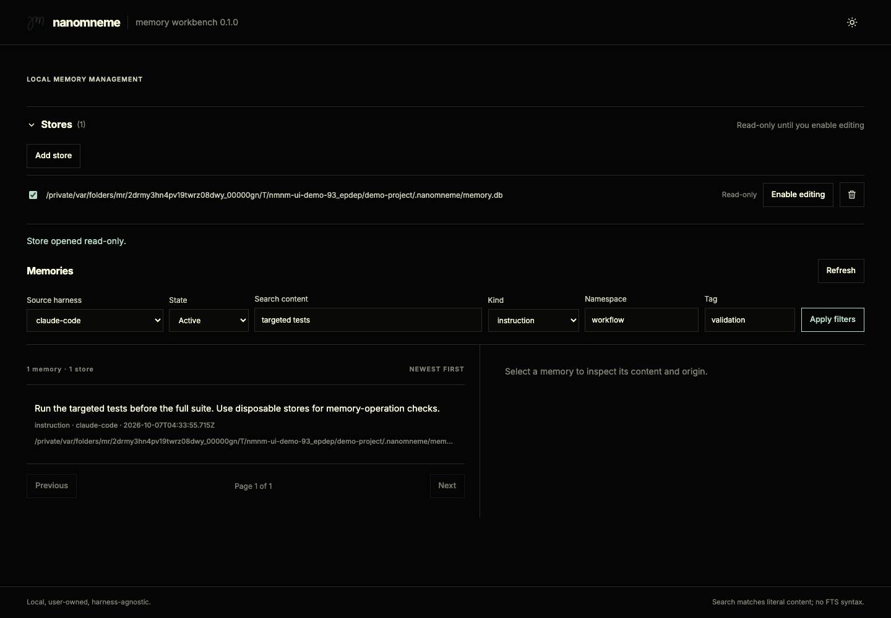
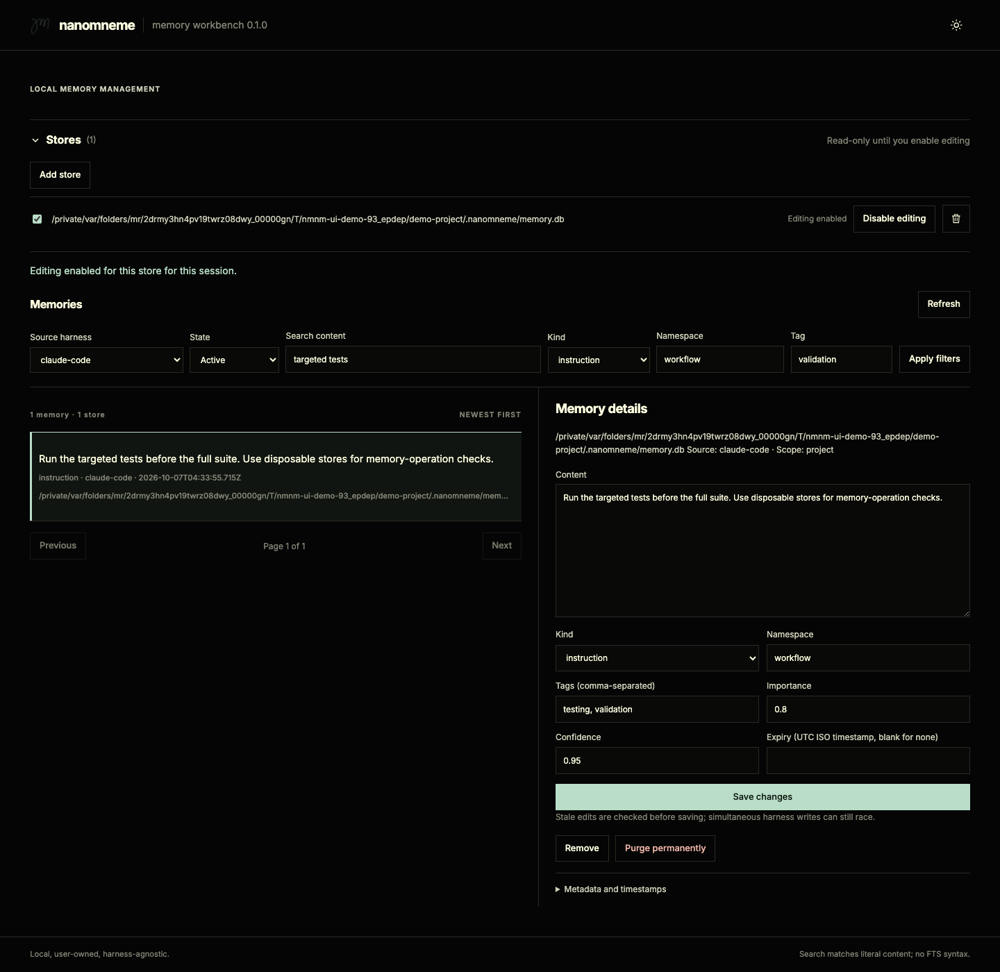
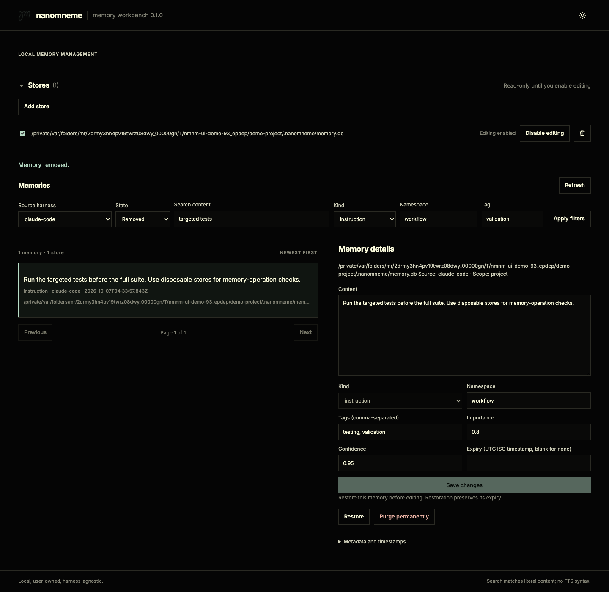

# nmnm-ui

Local browser workbench for reviewing and cleaning memories captured by coding-agent harnesses.

- Package: `@openlines/nmnm-ui` `0.1.1`; introduced in repository `0.8.0`, patched in `0.8.1`.
- Status: experimental; UI `0.1.0` is published on npm. This checkout prepares `0.1.1`; installed users receive these fixes only after publication.
- Runtime: Node foreground process, loopback HTTP, existing `nmnm-core` API.
- Frontend: plain HTML/CSS/JavaScript; local Inter fonts, Nanomneme logo, Openlines light/dark themes.
- No persistent daemon, framework, build step, model calls, or external runtime assets.

## Current scope

- Review existing memories outside Pi, Claude Code, OpenCode, or Codex.
- Select existing stores and recorded source harnesses explicitly.
- Inspect, edit, manage expiry, soft-remove, restore, and permanently purge individual records.
- Use existing core APIs; leave adapter settings and pin files unchanged.
- Use the CLI for creation, transfer, verification, repair, and recovery workflows unavailable here.

## Features

| Area | Available controls |
| --- | --- |
| Stores | Collapsible title with added-store count; one Add store directory picker, multiple-store selection, real-path deduplication, and trash icons that unregister without deleting databases. |
| Source | All sources, exact recorded harness, or Unknown/unrecorded. |
| Lifecycle | Active, Expired, Removed. |
| Search | Case-insensitive literal substring matching against content. |
| Filters | Kind, exact namespace, one exact tag; combine with source/state/search. |
| Listing | Five visible preview rows with independent scrolling; 50 records per page, newest updates first, record count, source and store labels. |
| Details | Full content, classification, scope, source, database path, metadata, ID, and timestamps. |
| Editing | Per-store authorization, changed-field patches, core validation. |
| Cleanup | Expiry renewal/clearing, confirmed removal, explicit restore, separate purge confirmation. |
| Drafts | Navigation/discard confirmation; draft retained when save fails or detects a conflict. |
| Refresh | Explicit database reread; automatic list/detail refresh after successful mutations. |
| Presentation | Package version beside memory workbench in the header, website-matched sun/moon theme toggle, fixed header/footer, keyboard focus and skip link, mobile details with Back navigation. |

## Launch

Initial launch before registering a store; screenshots use disposable sample memories.



Requirements:

- Node.js `22.19.0` or newer with built-in `node:sqlite` and FTS5.
- CLI `>= 0.4.1` with patched UI after publication, or repository checkout with workspace dependencies installed through `npm install`. Published CLI `0.4.0` bundles the earlier UI `0.1.0`.
- Existing compatible Nanomneme database; adding a store never creates it.
- Browser with JavaScript and tab-session storage enabled.

Installing `@openlines/nmnm-cli` also installs core and UI. From an installed CLI:

```sh
nmnm ui
nmnm ui --port 8080
nmnm ui -p 8080 -na
nmnm ui --help
nmnm ui --version
```

`ui` must be the first argument. Remaining arguments use the same UI parser as the standalone launcher; `ui --version` reports UI version, while `nmnm --version`/`nmnm -v` prints installed `cli`, `core`, and `ui` versions on separate labeled lines. Terminal memory flags such as `--db`, `--global`, and `--json` do not apply to UI launch; select stores inside the workbench.

From the repository root:

```sh
node packages/nmnm-ui/bin/nmnm-ui.js
```

1. The launcher opens the default browser automatically. If opening fails or is disabled, open the complete printed URL, including its credential fragment.
2. Click Add store, browse local directories, and select an existing database file.
3. Choose source, state, and filters; inspect records.
4. Enable editing for the target store when cleanup is needed.
5. Press Ctrl-C in the launch terminal to close the server and database handles.

| Option | Behavior |
| --- | --- |
| No options | Bind `127.0.0.1` on an OS-assigned port and open the default browser. |
| `--port <0..65535>`, `-p <0..65535>` | Select a port; `0` requests an available port. |
| `--no-auto`, `-na` | Start the server and print its URL without opening a browser. |
| `--help`, `-h` | Print usage and exit. |
| `--version`, `-v` | Print the UI package version and exit. |

```sh
node packages/nmnm-ui/bin/nmnm-ui.js --port 8080
node packages/nmnm-ui/bin/nmnm-ui.js --port 8080 --no-auto
```

- Workspace installation provides the `nmnm-ui` executable in `node_modules/.bin`; direct Node invocation works without a global install.
- The directory browser starts in the process launch directory, not the package directory.
- To review another project from this checkout, browse to that project's database in the picker.
- Open the printed `127.0.0.1` URL exactly; a `localhost` replacement fails Host validation.
- A restart creates a new credential; use the newly printed URL. Normal navigation fragments, including the skip link, do not replace the saved credential.
- Browser dispatch uses macOS `open`, Linux `xdg-open`, or Windows `start`. A missing, failed, or timed-out opener leaves the server running for manual access.

## CLI bundling and release preparation

- Checkout CLI `0.4.1` declares core `0.3.1` and UI `0.1.1` as regular dependencies. Both packages use the same core version.
- UI imports dynamically only for `nmnm ui`. Installing it does not start a daemon, server, or browser; terminal memory commands do not load UI.
- UI exports `launchWorkbench(args, { command })` from its package root; standalone and CLI launch share flags, browser dispatch, and shutdown.
- npm package contents include `bin/`, four explicitly listed runtime files in `src/`, `public/`, the web standards guide, README, and licenses. Tests, README screenshots, and build-only `src/ui-logger.js` are excluded; screenshots are available in the repository.
- CLI/UI require Node `22.19.0` or newer; independently installed core retains its own runtime requirement.
- Core `0.3.1`, UI `0.1.0`, and CLI `0.4.0` are published. UI `0.1.1` and CLI `0.4.1` are prepared for the repository `0.8.1` release; publication remains a separate maintainer action.
- For subsequent releases, publish any new core version first, then UI, then CLI. Validate tarballs before publishing; do not republish an existing version.
- Existing tagged-release workflow also publishes UI before CLI. Publication remains a separate maintainer action.

## Store selection

Browse local folders and select an existing Nanomneme database.



| Store | Common database path |
| --- | --- |
| Project | `<project directory>/.nanomneme/memory.db` |
| Global | `~/.local/share/nanomneme/memory.db` on Linux/macOS |
| Custom | Any explicitly selected compatible database file |

- Stores has a single Add store button. The picker starts at the launch directory, or the last directory browsed in this tab.
- Click Stores to collapse or expand its controls/list. The registered-store count includes unchecked stores and stays visible; collapsing preserves selection, editing authorization, and drafts. It starts expanded and resets on reload.
- The trash control closes connections, revokes editing authorization, clears memory selection, and returns focus to Add store without deleting the database. Unsaved edits require confirmation; re-addition opens read-only.
- Folder buttons navigate; Up selects the parent. Launch directory, Home, and Global directory shortcuts navigate without registering a store.
- Global directory is unavailable on other platforms. All platforms can browse explicit paths.
- The Directory field accepts absolute paths or paths relative to the launch directory; it does not expand shell `~` or environment variables.
- The picker lists directories and regular files, including hidden entries; it does not assume a `.db` extension. Registration accepts only files with compatible Nanomneme metadata, required tables/columns, and FTS5 structure; a matching filename or version marker alone is insufficient.
- Cancel or Escape closes the picker without adding a store. Invalid files and inaccessible directories report errors inside the picker.
- Files are opened in place on the launcher machine; there is no database upload, browser copy, or native OS file dialog.
- Paths resolve through realpath; symlink aliases of the same file reuse the registration.
- Multiple selected stores produce one combined list; identical IDs in different stores remain distinct.
- `(store, id)` identifies a record; resolved paths remain visible in rows and details.
- Selecting a database does not rewrite record scope or provenance.
- Uncheck a store to exclude it from browsing. Unchecking does not disable editing; use Disable editing separately.
- Registration opens read-only with `create: false` and checks core verification results for schema/SQLite integrity failures. Missing, unreadable, unrelated, or structurally incompatible databases report errors without registration or mutation. Enabling editing repeats this check before opening a writer.
- No recursive workspace discovery, database creation, or schema migration during registration.

## Source, search, and filters

Combine recorded source, content search, kind, namespace, and tag filters.



- Source choices come from `metadata.source` across all lifecycle states in selected stores.
- Typical recorded values: `pi`, `claude-code`, `opencode`, `codex`; custom recorded strings remain selectable.
- Unknown/unrecorded includes missing, empty, whitespace-only, or non-string sources.
- A literal recorded source named `unknown` remains distinct from Unknown/unrecorded.
- Source means recorded origin, not exclusive ownership or the currently running harness.
- Search examines content only, across the selected lifecycle state; it excludes tags/metadata/IDs from text matching.
- Search is case-insensitive literal substring matching; no Boolean expressions, phrases, prefixes, relevance ranking, or FTS syntax.
- Namespace and tag filters use exact recorded values; the tag control selects one tag.
- Filters combine with AND. Apply filters submits changes and returns to the first page. Unapplied inputs remain staged; Refresh, pagination, store changes, and mutation refreshes use the last applied filters.
- When result counts shrink, the list returns to the last valid page instead of displaying an empty out-of-range page.
- Ordering: descending `updated_at`, then store path and ID for ties. No user-selectable ordering.
- Refresh rereads selected databases. There is no polling or live harness-event subscription.

## Editing

Enable editing for a store, then inspect and update a memory's editable fields.



1. Select a record and inspect its source, scope, and resolved store path.
2. Choose Enable editing for that store.
3. Change supported fields and select Save changes.
4. Choose Disable editing to close its writable handle.

| Field | Editing rules |
| --- | --- |
| Content | Non-empty text; core normalization/Unicode validation applies. HTML-like text is displayed literally. |
| Kind | `note`, `decision`, `preference`, `fact`, `instruction`. |
| Namespace | Non-empty lowercase kebab-case slug. |
| Tags | Comma-separated lowercase kebab-case slugs; blank clears tags; core deduplicates/sorts. |
| Importance, confidence | Finite number from `0` through `1`. |
| Expiry | Exact UTC ISO timestamp, such as `2026-12-31T23:59:59.000Z`; blank clears expiry. |
| Scope, source, metadata | Read-only; edits preserve existing values. |
| ID, creation/update/removal timestamps | Read-only; mutations use core-generated lifecycle timestamps. |

- Read-only is the default for every newly registered store.
- Authorization is per store and shared within the foreground server session; it is not per browser tab.
- Browser controls and server-side authorization both enforce editing access.
- Save sends only changed allowed fields; validation errors preserve the editor draft.
- A pre-write `updated_at` comparison rejects detected stale records. Review/copy the draft before confirming a refresh or navigation that discards it.
- Browser interactions are temporarily inert during pending workbench requests, preventing overlapping responses from replacing newer drafts. Focus returns to the initiating control or its logical replacement; mobile inspection focuses the detail heading, and Back returns to the selected row.
- Changing records, views, selected stores, or pages prompts before discarding unsaved edits. Closing/reloading uses the browser's unload confirmation.
- No autosave, undo history, side-by-side conflict merge, or version history.

## Lifecycle and cleanup

The Removed view exposes restore and permanent purge actions.



| View | Definition | Available cleanup |
| --- | --- | --- |
| Active | Not removed; no expiry or expiry in the future. | Edit, adjust expiry, confirmed soft removal, explicit purge. |
| Expired | Not removed; expiry at or before current time. | Edit, renew/clear expiry, explicit purge. Soft removal disabled. |
| Removed | `removed_at` is set, regardless of expiry. | Explicit restore or purge. Editing disabled until restored. |

- Remove preserves canonical content, tags, and metadata; core removes the live FTS entry.
- Restore uses an explicit ID-only retain and preserves original expiry. A restored expired record belongs in Expired, not Active.
- Purge requires a separate confirmation showing the target store; deletion is irreversible within the live database.
- Purge does not delete exports/backups/snapshots or guarantee forensic/device erasure.
- Cleanup operates on one record at a time; there are no batch actions.
- UI cleanup does not remove adapter pins. Use the relevant adapter to unpin stale references.
- Successful removal or purge clears selection and resets details to “Select a memory to inspect its content and origin.” Successful edits/restores refresh details; every successful mutation refreshes the list.

## Session and access boundaries

| State | Location and lifetime |
| --- | --- |
| Registered paths and editing authorization | Server memory; cleared when the foreground process stops. |
| Selected stores, filters, current page, drafts | Browser memory; reset on page reload. |
| Launch credential | URL fragment on first open, then tab-session storage; removed from the visible URL after capture. |
| Theme | Browser local storage; restored on later visits to that origin. |
| Memory content | SQLite source of truth and transient server/browser memory; not persisted in browser storage. |

- API requests require the per-launch credential; Host and any supplied Origin must match the exact local server origin.
- No CORS allowance or remote bind option. Only packaged allowlisted browser assets are served; authenticated directory browsing returns entry names/types/paths, not file contents.
- Mutation bodies require JSON and are capped at 1 MiB. The browser uses a restrictive CSP and renders memory values as text.
- The HTTP API is internal and experimental; it is not a stable integration contract.
- Anyone with the credential and local server access can operate on registered stores. This is a local workbench, not a multi-user authorization system.

## Opt-in Logslines diagnostics

- Enable `"logging": { "enabled": true }` in `~/.local/share/nanomneme/config.jsonc`; JSONC comments/trailing commas are supported.
- Default off; invalid configuration disables logging. No UI/project override. Settings are reread per action without restarting.
- Output: `~/.local/share/nanomneme/logs/nmnm-ui.jsonl`; owner-only directory/files on POSIX. Component `nmnm-ui`, installed UI version, null session ID, empty attributes.
- Logging failures preserve operation results and original errors; no stderr fallback.

| Action | Operation / event |
| --- | --- |
| Edit content/fields, change expiry, restore | `retain` / `memory.retained` |
| Soft remove, purge | `remove` / `memory.removed` |
| Request/validation/read, launcher/browser-opener, captured browser errors | `ui_error` / `ui.error` |

- Mutations emit one terminal outcome: success, failure, blocked, or missing target where supported. Mutation errors are not duplicated as general errors.
- Successful reads, filters, store selection, editing authorization, navigation, help/version, canceled actions, and empty patches emit nothing.
- Browser errors use authenticated best-effort reports capped at 600 message characters. Reports cannot reach an unavailable server; errors before browser reporting initializes are not captured.
- Records omit structured memory content, IDs, paths, queries, launch credentials, and stacks. Raw error messages are preserved without redaction and may contain sensitive input or paths. Review logs before sharing.
- File roles and generation rules: [Logger manual](../../docs/LOGGER.md#source-and-artifact-map).
- Mutations reuse `@openlines/nmnm-core/logging`. General errors use a UI-only bundled Logslines emitter; the shared logging implementation remains unchanged.

## Current limitations

- **Full-store reads:** core `export()` supplies management snapshots; lists/details read all records in the requested stores before filtering/pagination. Costs grow with record count/content size. Pagination bounds displayed results, not underlying read work.
- **Activation checks:** core verification scans the database during registration and when enabling editing; large stores can take longer to activate.
- **Independent snapshots:** combined stores are read separately; there is no cross-store atomic snapshot.
- **Concurrent writers:** stale checks are separate from mutation. A harness can write between them; the UI cannot guarantee atomic conflict rejection. Core patch/transaction semantics still apply.
- **Blocking reads:** synchronous core work runs in the foreground Node server; large exports or SQLite contention can delay browser requests.
- **Scoped verification gate:** registration and editing authorization reject schema/SQLite integrity failures from core `verify()`. Other reported issues, such as permissions, canonical values, tags, or FTS contents, do not establish file identity and are not blanket registration blockers. Use CLI verification for a full health report; the UI does not repair files.
- **Lifecycle restrictions:** expired records cannot be soft-removed; removed records require restoration before editing.
- **Session-only configuration:** store registrations are not saved to disk; browser reload resets selection/filter state. Other browser tabs do not automatically synchronize their displayed editing state.
- **Platform coverage:** Linux/macOS have standard global-path selection. Other platforms need explicit custom paths; comprehensive Windows validation is not claimed.
- **Recovery:** no UI backup, transfer, repair, undo, or automatic cleanup. See the [Core and CLI Manual](../../docs/CORE_CLI_MANUAL.md#portability-and-recovery).

## Troubleshooting

| Symptom | Action |
| --- | --- |
| Missing database | Choose an existing path. Use CLI retain to create a store if needed. |
| Incompatible schema | Use a matching core/CLI version and its documented migration/recovery workflow. UI registration does not migrate. |
| Authorization error | Open the full URL from the currently running launcher. |
| Local-origin rejection | Use the exact printed `127.0.0.1` URL and port. |
| Browser does not open | Open the full printed URL manually; check the platform opener or use `--no-auto`/`-na`. |
| No records | Check selected stores, source, lifecycle, search, namespace, and tag filters. |
| Editing controls disabled | Enable editing for the target store; restore removed records before editing. |
| Save reports a conflict | Preserve the draft, refresh deliberately, inspect the newer version, then reapply changes. |
| Validation error | Check field rules, score bounds, and the exact UTC expiry format. |
| SQLite busy or permission error | Check filesystem permissions/competing writers, then retry. UI does not automatically retry mutations. |
| Removed record still referenced by a harness | Refresh harness context and manage adapter pins through that adapter. |

## Future features

Not implemented; no release dates committed:

- Shared general-error emission through core’s public logging API, replacing the UI-only emitter/bundle; requires a separately approved shared/core change.
- New memory creation.
- JSONL import/export controls.
- Integrity verification and explicit FTS repair controls.
- Exact backup and recovery workflows.
- Bulk removal, editing, and purge.
- Duplicate review and merging.
- Cross-store moves.
- Adapter configuration and pin management.
- Automated cleanup.
- Workspace store discovery.
- Advanced FTS search.

## Validation

From the repository root:

```sh
node --test packages/nmnm-ui/test/*.test.js
npm run validate
```

- `npm run validate` includes generated-output checks, the full repository suite, shipped-dependency audit, and standalone package checks; npm registry access is required. It never regenerates bundles or refreshes Codex. Use `npm test` for the suite alone; see the [logger guide](../../docs/LOGGER.md) for explicit maintenance commands.

- Disposable-store tests cover read-only enforcement, lifecycle operations, provenance, stale edits, duplicate IDs across stores, pagination, schema rejection, split Unicode requests, HTTP boundaries, launcher flags, and shutdown.
- Logging tests cover schema conformance, mutation/error outcomes, duplicate suppression, opt-in/config refresh, quiet reads, payload exclusion, file permissions, and sink failure isolation.
- Launcher tests cover platform command dispatch, opener failures/timeouts/cancellation, default automatic dispatch, and both opt-out flags. Automated tests use fake openers; they do not verify desktop browser launch on every platform.
- Rendered suites require Python Playwright and installed browser engines; root development dependencies supply axe-core. These are test tools, not UI runtime dependencies. CI and tagged releases run separate blocking Ubuntu matrix lanes for Chromium, Firefox, and WebKit; publishing requires repository validation and every browser lane:

```sh
python3 packages/nmnm-ui/test/browser.py
python3 packages/nmnm-ui/test/browser_regressions.py
```

- These commands default to Chromium; set `NMNM_UI_BROWSER=firefox` or `NMNM_UI_BROWSER=webkit` for other engines. See [Workbench web standards](docs/WEB_STANDARDS.md) for installation, all-engine commands, accessibility rules, and manual release checks.

- Browser checks cover directory navigation/selection/errors, store removal and collapse/count controls, independent list scrolling, source selection, literal rendering, read-only controls, drafts, pending-request protection, cleanup, expiry, keyboard focus, theme icons, fixed header/footer, mobile navigation, and browser error reporting.
- The rendered suite creates and cleans its own temporary database/server. Screenshots are saved to `/tmp/nmnm-ui-*.png`.
- CI uses Python 3.14 and Playwright 1.62.0, installs each matrix engine with Linux dependencies, and has a 15-minute timeout per lane. Available screenshots and axe reports upload even after failure and remain downloadable for 7 days. No credentials or deployed server are required. WebKit explicitly focuses the skip link because default link tabbing is platform-dependent; native desktop browser opening and full accessibility conformance are not established.
- Regression checks cover anchor-safe credential reloads, last-page shrink, staged filters, keyboard/mobile focus, semantic headings/picker groups, control/focus contrast, 320px reflow with text spacing, and axe scans across five workbench states in both themes. Incomplete axe findings are retained for manual review; WCAG 2.2 AA is the maintenance target, not a certification.
- Use disposable stores for mutation testing; never personal databases.

## Implementation and related documentation

| Entry | Responsibility |
| --- | --- |
| `bin/nmnm-ui.js` | Executable entry delegating to the shared launcher. |
| `src/launcher.js` | Flags, foreground server lifecycle, printed credential URL, platform browser dispatch, and signal shutdown. |
| `src/server.js` | Local HTTP/assets, store registrations, authorization, core reads/mutations. |
| `src/logslines.js` | Core mutation binding and general-error deduplication. |
| `src/ui-logger.js` | Build-only UI error emitter source; bundled by `scripts/build-logger.js` and excluded from the npm package. |
| `src/ui-logging-runtime.generated.js` | Self-contained error logger shipped in the npm package. |
| `public/` | Browser workbench, styles, local fonts, and logos. |
| `test/` | Node tests and Python browser checks, including the blocking rendered CI job. |

- [Root README](../../README.md): product overview and package index.
- [Architecture](../../docs/ARCHITECTURE.md): ownership and storage boundaries.
- [Memory handling](../../docs/SEQUENCE_MEMORY_HANDLING.md#nmnm-ui): implemented UI-to-core flow.
- [Core and CLI Manual](../../docs/CORE_CLI_MANUAL.md): canonical contract, transfer, verification, and recovery.
- [Changelog](../../CHANGELOG.md): repository release history.
- Inter license: `public/assets/FONT-LICENSE.txt`; fonts/logo styling follow the Nanomneme website's Openlines design language.
